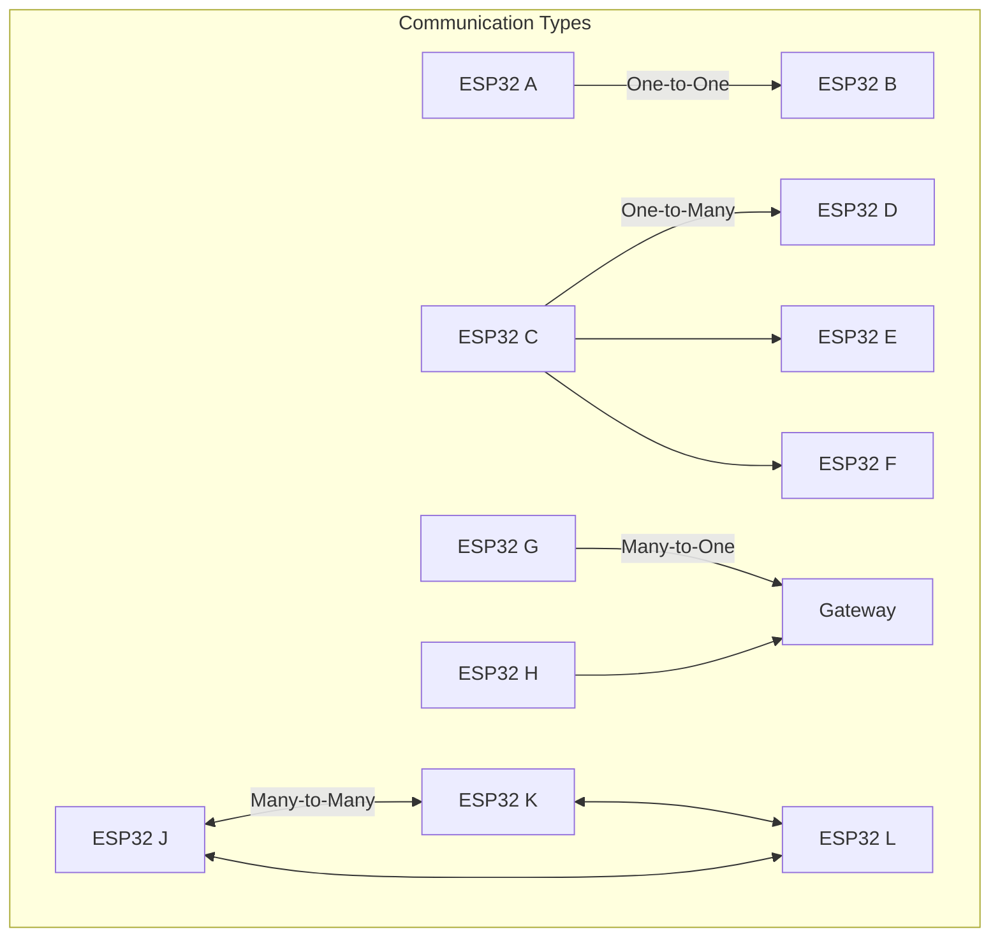
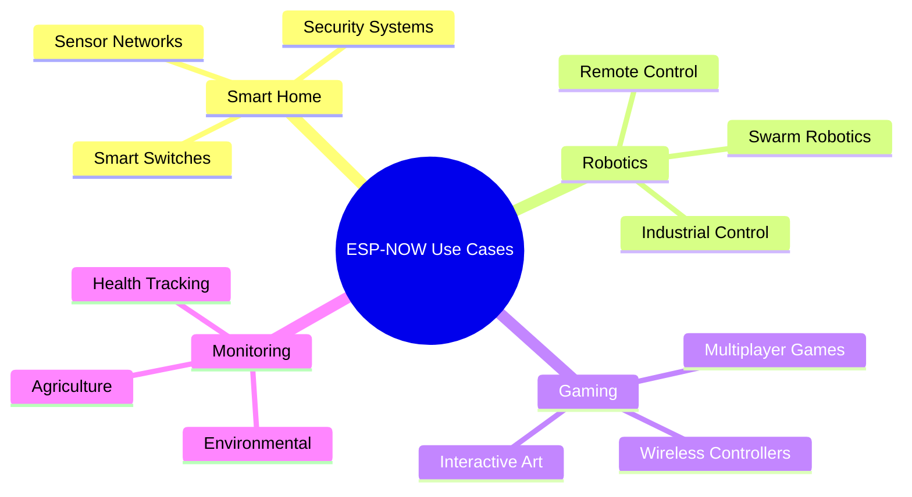
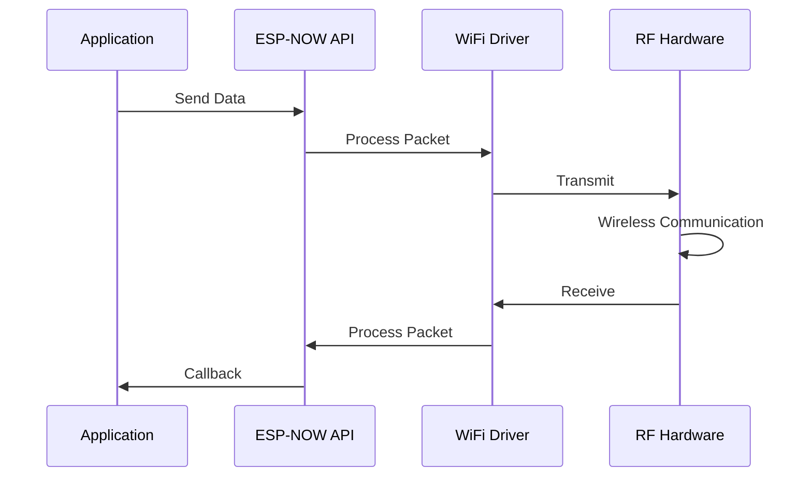
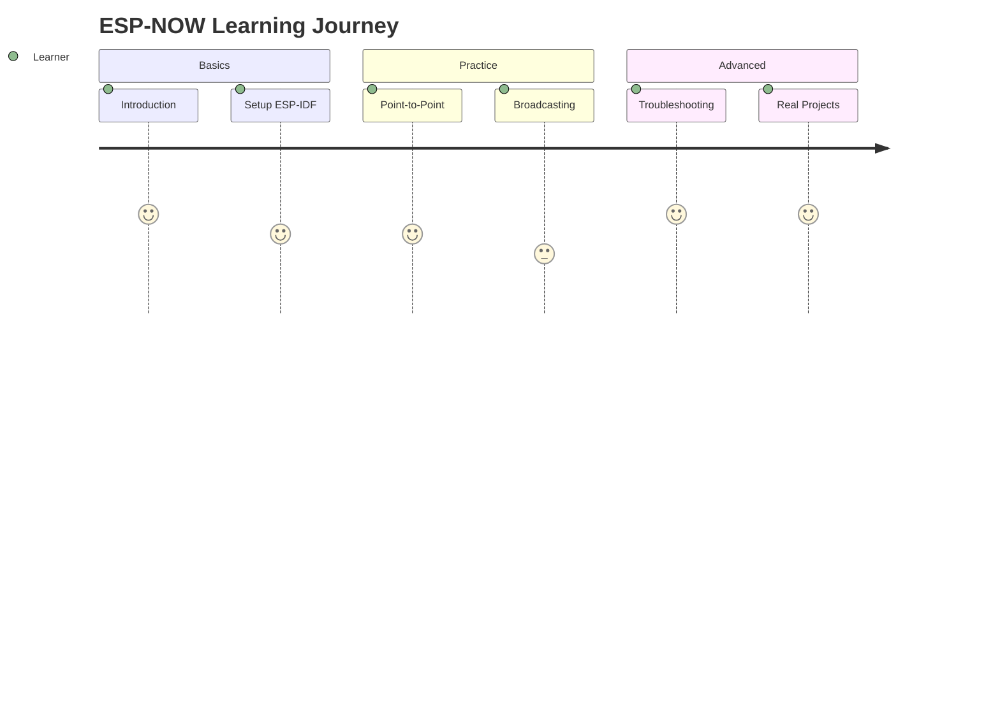

# บทที่ 1: แนะนำ ESP-NOW 
## การสื่อสารไร้สายสำหรับ ESP32 ด้วย ESP-IDF


ESP-NOW เป็นโปรโตคอลการสื่อสารไร้สายที่พัฒนาโดย Espressif สำหรับการสื่อสารระหว่างอุปกรณ์ ESP32 โดยไม่ต้องใช้ Wi-Fi Router หรือ Access Point

### เป้าหมายการเรียนรู้
- เข้าใจหลักการทำงานของ ESP-NOW
- รู้จักข้อดีและข้อจำกัดของ ESP-NOW
- เรียนรู้กรณีการใช้งานต่างๆ
- เตรียมพร้อมสำหรับการพัฒนาด้วย ESP-IDF

---

## ESP-NOW คืออะไร?

ESP-NOW เป็นโปรโตคอลการสื่อสารแบบ **connectionless** ที่ใช้ IEEE 802.11 (Wi-Fi) เป็นฐาน แต่ไม่ต้องการการเชื่อมต่อ Wi-Fi แบบดั้งเดิม

### คุณสมบัติหลัก:

1. **การสื่อสารโดยตรง** - ไม่ต้องใช้ Router หรือ Access Point
2. **ความเร็วสูง** - Latency ต่ำ เหมาะกับแอปพลิเคชันที่ต้องการ Real-time
3. **การเข้ารหัส** - รองรับ AES-128 encryption
4. **ประหยัดพลังงาน** - เหมาะกับอุปกรณ์ Battery-powered
5. **การสื่อสารแบบ Broadcast** - สามารถส่งข้อมูลให้อุปกรณ์หลายตัวพร้อมกัน

### รูปแบบการสื่อสาร:
- **One-to-One**: ESP32 หนึ่งตัวส่งให้อีกตัวหนึ่ง
- **One-to-Many**: ESP32 หนึ่งตัวส่งให้หลายตัว (Broadcasting)
- **Many-to-One**: ESP32 หลายตัวส่งมายังตัวเดียว (Data Collection)
- **Many-to-Many**: การสื่อสารแบบเครือข่าย Mesh



---

## ข้อดีและข้อจำกัดของ ESP-NOW

### ✅ ข้อดี:
- **ความเร็วสูง**: Latency ต่ำกว่า 10ms
- **ไม่ต้องใช้ Router**: สื่อสารโดยตรงระหว่างอุปกรณ์
- **ประหยัดพลังงาน**: เหมาะกับโปรเจค IoT
- **ง่ายต่อการใช้งาน**: API ที่เรียบง่าย
- **รองรับ Encryption**: ความปลอดภัยระดับ AES-128
- **Range ไกล**: ระยะทางถึง 200+ เมตร (กลางแจ้ง)

### ❌ ข้อจำกัด:
- **ข้อมูลจำกัด**: สูงสุด 250 bytes ต่อ packet
- **จำนวน Peers จำกัด**: สูงสุด 20 peers (10 encrypted + 10 unencrypted)
- **ไม่รองรับ Internet**: ไม่สามารถเชื่อมต่อ Internet โดยตรง
- **ต้องใช้ Channel เดียวกัน**: อุปกรณ์ทั้งหมดต้องอยู่ในช่องสัญญาณเดียวกัน
- **ไม่มี Acknowledgment**: ไม่รับประกันการส่งข้อมูลสำเร็จ (ต้องทำเอง)

---

## กรณีการใช้งาน ESP-NOW

### 1. 🏠 Smart Home & IoT
- **Sensor Networks**: เซ็นเซอร์หลายตัวส่งข้อมูลมายัง Gateway
- **Smart Switches**: สวิตช์ไร้สายควบคุมไฟ LED
- **Security Systems**: ระบบรักษาความปลอดภัยแบบ Real-time

### 2. 🤖 Robotics & Automation  
- **Remote Control**: การควบคุมหุ่นยนต์แบบไร้สาย
- **Swarm Robotics**: หุ่นยนต์กลุ่มที่ทำงานร่วมกัน
- **Industrial Control**: ระบบควบคุมในโรงงาน

### 3. 🎮 Gaming & Entertainment
- **Wireless Controllers**: จอยสติกแบบไร้สาย
- **Multiplayer Games**: เกมส์ที่เล่นได้หลายคน
- **Interactive Art**: งานศิลปะที่โต้ตอบได้

### 4. 📊 Data Collection & Monitoring
- **Environmental Monitoring**: ตรวจสอบสภาพแวดล้อม
- **Agriculture**: ระบบเกษตรอัจฉริยะ
- **Health Monitoring**: ตรวจสอบสุขภาพ



---

## การเปรียบเทียบ ESP-NOW กับเทคโนโลยีอื่น

| คุณสมบัติ | ESP-NOW | WiFi | Bluetooth | LoRa |
|----------|---------|------|-----------|------|
| **Range** | 200+ เมตร | 50-100 เมตร | 10-30 เมตร | 2-15 กม. |
| **Latency** | < 10ms | 50-200ms | 100-500ms | 1-10 วินาที |
| **Power** | ต่ำ | สูง | กลาง | ต่ำมาก |
| **Data Rate** | 1 Mbps | 150 Mbps | 2 Mbps | 50 kbps |
| **Setup** | ง่าย | ซับซ้อน | ปานกลาง | ง่าย |
| **Cost** | ต่ำ | กลาง | ต่ำ | สูง |

### เมื่อไรควรใช้ ESP-NOW?
✅ **เหมาะสำหรับ:**
- แอปพลิเคชันที่ต้องการ Real-time response
- ระบบที่ไม่ต้องการ Internet connection
- อุปกรณ์ที่ใช้แบตเตอรี่
- การสื่อสารระยะกลาง (< 200m)

❌ **ไม่เหมาะสำหรับ:**
- การส่งไฟล์ขนาดใหญ่
- แอปพลิเคชันที่ต้องการ Internet
- ระบบที่ต้องการ Reliability สูงมาก
- การสื่อสารระยะไกลมาก (> 1km)

---

## สถาปัตยกรรมของ ESP-NOW

### 1. MAC Address Based Communication
ESP-NOW ใช้ MAC Address ในการระบุอุปกรณ์แต่ละตัว

```
Device A (AA:BB:CC:DD:EE:01) ←→ Device B (AA:BB:CC:DD:EE:02)
```

### 2. Peer Management
- แต่ละอุปกรณ์ต้อง **เพิ่ม Peer** ก่อนการส่งข้อมูล
- สามารถจัดการ Peer list ได้แบบ Dynamic
- รองรับทั้ง **Encrypted** และ **Unencrypted** peers

### 3. Callback Functions
ESP-NOW ใช้ Callback functions สำหรับจัดการ Events:

```c
// Callback เมื่อส่งข้อมูลเสร็จ
void on_data_sent(const uint8_t *mac_addr, esp_now_send_status_t status)

// Callback เมื่อรับข้อมูล
void on_data_recv(const uint8_t *mac_addr, const uint8_t *data, int len)
```

### 4. Data Flow


---

## ความต้องการของระบบ

### Hardware Requirements:
- **ESP32** (ESP32, ESP32-S2, ESP32-S3, ESP32-C3)
- **แหล่งจ่ายไฟ**: 3.3V (แบตเตอรี่ หรือ USB)
- **Antenna**: Internal หรือ External

### Software Requirements:
- **ESP-IDF v4.4+** (แนะนำ v5.0+)
- **CMake 3.16+**
- **Python 3.8+**
- **Git**

### Development Environment:
- **VS Code** + ESP-IDF Extension
- **Terminal** สำหรับ Command Line
- **Serial Monitor** สำหรับ Debug

### Knowledge Prerequisites:
- พื้นฐาน **C Programming**
- ความเข้าใจ **ESP-IDF Framework**
- พื้นฐาน **Networking concepts**
- ความรู้เรื่อง **FreeRTOS** (เบื้องต้น)

---

## โครงสร้างการเรียนรู้

ในหลักสูตรนี้ เราจะเรียนรู้ ESP-NOW แบบ step-by-step ผ่าน Markdown documents ดังนี้:

### 📚 Document Series:

1. **01-ESP-NOW-Introduction.md** (ปัจจุบัน)
   - แนะนำและทฤษฎีพื้นฐาน

2. **02-ESP-IDF-Setup.md** 
   - การติดตั้งและตั้งค่า ESP-IDF
   - การสร้างโปรเจคแรก

3. **03-Point-to-Point-Communication.md**
   - การสื่อสารระหว่าง ESP32 2 ตัว
   - Sender และ Receiver

4. **04-Group-Broadcasting.md**
   - การ Broadcast ข้อมูลหลายตัว
   - One-to-Many และ Many-to-Many

5. **05-Advanced-Troubleshooting.md**
   - การ Debug และแก้ปัญหา
   - เทคนิคการใช้งานขั้นสูง

### 🎯 จุดประสงค์การเรียนรู้:
- สามารถใช้ ESP-NOW ในโปรเจคจริงได้
- เข้าใจการทำงานและข้อจำกัด  
- รู้วิธีแก้ปัญหาเบื้องต้น
- สามารถออกแบบระบบ ESP-NOW ได้



---

## สรุป

ESP-NOW เป็นเทคโนโลยีที่ทรงพลังสำหรับการสื่อสารไร้สายระหว่าง ESP32 ที่มีข้อดีหลายประการ:

### 🌟 จุดเด่น:
- **ง่ายต่อการใช้งาน** - API ที่เรียบง่าย
- **ความเร็วสูง** - Latency ต่ำ เหมาะกับ Real-time applications
- **ประหยัดพลังงาน** - เหมาะกับอุปกรณ์ Battery-powered
- **ไม่ต้องใช้โครงสร้างพื้นฐาน** - ไม่ต้องมี Router หรือ Internet

### 🎯 เหมาะสำหรับ:
- IoT และ Smart Home projects
- ระบบควบคุมแบบไร้สาย
- Sensor networks
- Gaming controllers
- Robotics applications

### 📖 ขั้นตอนต่อไป:
ในบทต่อไป เราจะเรียนรู้การติดตั้งและตั้งค่า ESP-IDF เพื่อเริ่มต้นพัฒนาด้วย ESP-NOW

**➡️ ไปที่: [02-ESP-IDF-Setup.md](02-ESP-IDF-Setup.md)**

---
*หมายเหตุ: ตรวจสอบให้แน่ใจว่าคุณมี ESP32 อย่างน้อย 2 ตัวสำหรับการทดลอง*