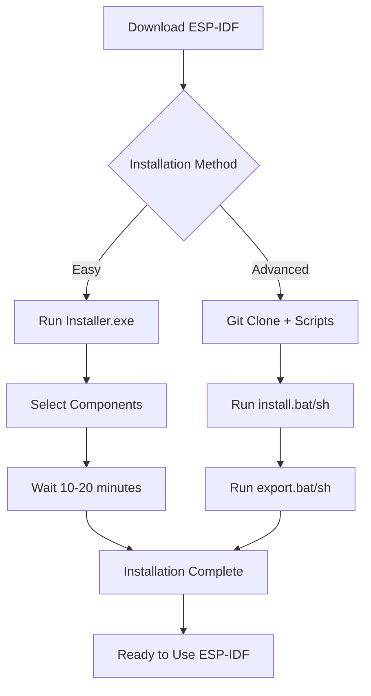
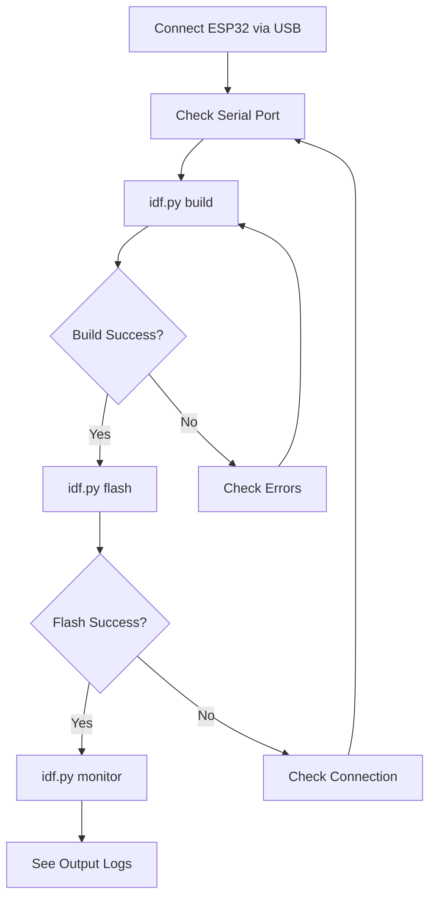
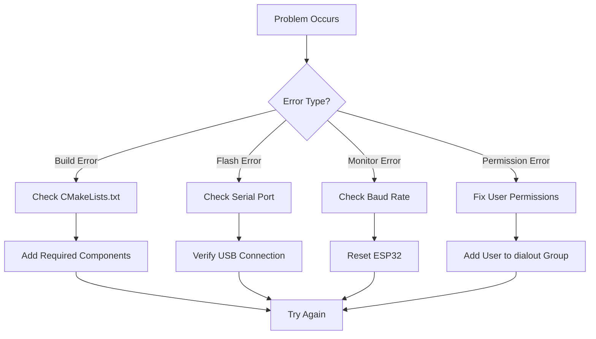

# บทที่ 2: การติดตั้งและตั้งค่า ESP-IDF
## เตรียมพร้อมสำหรับการพัฒนา ESP-NOW


ในบทนี้เราจะเรียนรู้การติดตั้งและตั้งค่า ESP-IDF (Espressif IoT Development Framework) เพื่อเตรียมพร้อมสำหรับการพัฒนา ESP-NOW

### เป้าหมายการเรียนรู้:
- ติดตั้ง ESP-IDF บนระบบ Windows และ macOS
- ตั้งค่า Command Line Environment
- สร้างและ Build โปรเจคแรก
- ทดสอบการเชื่อมต่อกับ ESP32
- เข้าใจโครงสร้างโปรเจค ESP-IDF

---

## ขั้นตอนที่ 1: การติดตั้ง ESP-IDF

### วิธีที่ 1: ใช้ ESP-IDF Installer (แนะนำสำหรับผู้เริ่มต้น)

1. **ดาวน์โหลด ESP-IDF Installer**
   - ไปที่: https://dl.espressif.com/dl/esp-idf/
   - เลือก Windows Installer (.exe)
   - เวอร์ชันที่แนะนำ: ESP-IDF v5.1+

2. **รันไฟล์ Installer**
   - คลิกขวาแล้วเลือก "Run as administrator"
   - เลือก Installation path (แนะนำ: `C:\Espressif`)
   - เลือก Components ที่ต้องการ:
     - ✅ ESP-IDF
     - ✅ ESP-IDF Tools
     - ✅ Python
     - ✅ Git

3. **รอการติดตั้งเสร็จสิ้น**
   - ใช้เวลาประมาณ 10-20 นาที
   - ระบบจะติดตั้ง Python, Git, และ Tools อัตโนมัติ

### วิธีที่ 2: ติดตั้งด้วย Command Line (สำหรับผู้ใช้งานขั้นสูง)

```bash
# Clone ESP-IDF repository
git clone --recursive https://github.com/espressif/esp-idf.git
cd esp-idf
git checkout v5.1

# Install tools
./install.bat    # Windows
./install.sh     # macOS/Linux

# Setup environment
./export.bat     # Windows  
./export.sh      # macOS/Linux
```



---

## ขั้นตอนที่ 2: การตั้งค่า Command Line Environment

### 1. เปิด ESP-IDF Command Prompt

**สำหรับ Windows:**
- เปิด "ESP-IDF Command Prompt" จาก Start Menu
- หรือเปิด Command Prompt แล้วรันคำสั่ง:
  ```cmd
  %USERPROFILE%\esp\esp-idf\export.bat
  ```

**สำหรับ macOS/Linux:**
- เปิด Terminal
- รันคำสั่ง:
  ```bash
  . $HOME/esp/esp-idf/export.sh
  ```

### 2. ทดสอบการติดตั้ง
รันคำสั่งต่อไปนี้เพื่อตรวจสอบ:

```bash
idf.py --version
python --version
git --version
```

**ผลลัพธ์ที่คาดหวัง:**
```
ESP-IDF v5.1.x
Python 3.8.x
git version 2.x.x
```

### 3. ตั้งค่า Serial Port (Optional)

**Windows:** ตรวจสอบ Device Manager → Ports (COM & LPT)
**macOS:** รันคำสั่ง `ls /dev/cu.*`
**Linux:** รันคำสั่ง `ls /dev/ttyUSB*`

### 4. Text Editor แนะนำ (Optional)
- **VS Code** - มี ESP-IDF Extension
- **Sublime Text** - เบาและรวดเร็ว  
- **Vim/Nano** - สำหรับ Terminal
- **Notepad++** - สำหรับ Windows

---

## ขั้นตอนที่ 3: สร้างโปรเจคแรกด้วย idf.py

### 1. สร้างโปรเจคใหม่

เปิด ESP-IDF Command Prompt/Terminal และรันคำสั่ง:

```bash
# สร้างโปรเจคจาก template
idf.py create-project esp_now_test

# หรือ copy จาก example
cp -r $IDF_PATH/examples/get-started/hello_world esp_now_test
```

### 2. เข้าไปในโฟลเดอร์โปรเจค

```bash
cd esp_now_test
```

### 3. โครงสร้างโปรเจค ESP-IDF

โปรเจคที่สร้างขึ้นจะมีโครงสร้างดังนี้:

```
esp_now_test/
├── main/
│   ├── main.c              # ไฟล์โค้ดหลัก
│   └── CMakeLists.txt      # Build configuration
├── CMakeLists.txt          # Project configuration
├── sdkconfig               # ESP-IDF configuration (สร้างหลัง menuconfig)
└── build/                  # Build output (สร้างหลัง build)
```

### 4. แก้ไขไฟล์ main.c

ใช้ Text Editor ที่ชอบเปิดไฟล์ `main/main.c` และแก้ไขเป็น:

```c
#include <stdio.h>
#include "freertos/FreeRTOS.h"
#include "freertos/task.h"
#include "esp_log.h"

static const char* TAG = "ESPNOW_TEST";

void app_main(void)
{
    ESP_LOGI(TAG, "ESP-NOW Test Project Started!");
    
    while(1) {
        ESP_LOGI(TAG, "Hello ESP-NOW!");
        vTaskDelay(pdMS_TO_TICKS(1000));
    }
}
```

### 5. ตั้งค่าเป้าหมาย (Target)

```bash
# สำหรับ ESP32
idf.py set-target esp32

# สำหรับ ESP32-S2
# idf.py set-target esp32s2

# สำหรับ ESP32-C3
# idf.py set-target esp32c3
```

---

## ขั้นตอนที่ 4: Build และ Flash ด้วย idf.py

### 1. เชื่อมต่อ ESP32
- เสียบสาย USB ระหว่าง ESP32 และคอมพิวเตอร์
- ตรวจสอบ Port ที่เชื่อมต่อ:

**Windows:** Device Manager → Ports (COM & LPT) → จดบันทึก COM Port (เช่น COM3)
**macOS:** รันคำสั่ง `ls /dev/cu.*` → จดบันทึก `/dev/cu.usbserial-*`
**Linux:** รันคำสั่ง `ls /dev/ttyUSB*` → จดบันทึก `/dev/ttyUSB0`

### 2. การ Build โปรเจค

```bash
# Build โปรเจค
idf.py build
```

**ผลลัพธ์ที่คาดหวัง:**
```
Project build complete. To flash, run this command:
idf.py -p (PORT) flash
✅ Binary files สร้างในโฟลเดอร์ build/
```

### 3. การกำหนดค่าโปรเจค (Optional)

```bash
# เปิด configuration menu
idf.py menuconfig
```

### 4. การ Flash โปรแกรมลง ESP32

```bash
# Flash โปรแกรม (ระบุ port)
idf.py -p COM3 flash              # Windows
idf.py -p /dev/cu.usbserial-* flash  # macOS  
idf.py -p /dev/ttyUSB0 flash      # Linux

# หรือไม่ระบุ port
idf.py flash
```

**ผลลัพธ์ที่คาดหวัง:**
```
Hard resetting via RTS pin...
Done
✅ Flash successful!
🔄 ESP32 จะ Restart อัตโนมัติ
```

### 5. คำสั่งรวม (All-in-One)

```bash
# Build, Flash และ Monitor ในคำสั่งเดียว
idf.py -p COM3 build flash monitor

# หรือให้ระบบหา port อัตโนมัติ
idf.py build flash monitor
```



---

## ขั้นตอนที่ 5: การใช้งาน Serial Monitor ด้วย idf.py

### 1. เปิด Serial Monitor

```bash
# เปิด Monitor
idf.py -p COM3 monitor           # Windows
idf.py -p /dev/cu.usbserial-* monitor  # macOS
idf.py -p /dev/ttyUSB0 monitor   # Linux

# หรือไม่ระบุ port
idf.py monitor
```

### 2. การตั้งค่า Baud Rate (ถ้าจำเป็น)

```bash
# ระบุ baud rate
idf.py -p COM3 -b 115200 monitor

# หรือแก้ไขในไฟล์ sdkconfig
# CONFIG_ESP_CONSOLE_UART_BAUDRATE=115200
```

### 3. ผลลัพธ์ที่คาดหวัง

หลังจาก Flash โปรแกรมลง ESP32 แล้ว คุณควรเห็นข้อความดังนี้:

```
RST:0x1 (POWERON_RESET),boot:0x13 (SPI_FAST_FLASH_BOOT)
configsip: 0, SPIWP:0xee
clk_drv:0x00,q_drv:0x00,d_drv:0x00,cs0_drv:0x00,hd_drv:0x00,wp_drv:0x00
mode:DIO, clock div:2
load:0x3fff0030,len:7204
...
I (320) cpu_start: Starting scheduler on APP CPU.
I (330) ESPNOW_TEST: ESP-NOW Test Project Started!
I (1330) ESPNOW_TEST: Hello ESP-NOW!
I (2330) ESPNOW_TEST: Hello ESP-NOW!
I (3330) ESPNOW_TEST: Hello ESP-NOW!
```

### 4. การควบคุม Monitor

**คำสั่งใน Monitor Mode:**
- `Ctrl+C` - ออกจาก Monitor
- `Ctrl+T` `Ctrl+R` - Reset ESP32
- `Ctrl+T` `Ctrl+F` - เข้า Download mode
- `Ctrl+T` `Ctrl+A` - เข้า ROM boot mode
- `Ctrl+T` `Ctrl+H` - แสดงความช่วยเหลือ

### 5. Troubleshooting Monitor

```bash
# ถ้า Monitor ไม่ทำงาน ลองคำสั่งนี้
idf.py -p COM3 monitor --print_filter="*:V"

# หรือตรวจสอบ permission (Linux/macOS)
sudo chmod 666 /dev/ttyUSB0
```

---

## การเตรียม ESP-NOW Components

### 1. เพิ่ม ESP-NOW ใน CMakeLists.txt

ใช้ Text Editor แก้ไขไฟล์ `main/CMakeLists.txt`:

```cmake
idf_component_register(
    SRCS "main.c"
    INCLUDE_DIRS "."
    REQUIRES esp_wifi esp_now nvs_flash
)
```

### 2. ตั้งค่า Wi-Fi สำหรับ ESP-NOW

แก้ไขไฟล์ `main/main.c` เพื่อเพิ่มการตั้งค่า Wi-Fi:

```c
#include <stdio.h>
#include <string.h>
#include "freertos/FreeRTOS.h"
#include "freertos/task.h"
#include "esp_system.h"
#include "esp_wifi.h"
#include "esp_event.h"
#include "esp_log.h"
#include "nvs_flash.h"
#include "esp_now.h"

static const char* TAG = "ESPNOW_SETUP";

void wifi_init(void)
{
    ESP_ERROR_CHECK(esp_netif_init());
    ESP_ERROR_CHECK(esp_event_loop_create_default());
    
    wifi_init_config_t cfg = WIFI_INIT_CONFIG_DEFAULT();
    ESP_ERROR_CHECK(esp_wifi_init(&cfg));
    ESP_ERROR_CHECK(esp_wifi_set_storage(WIFI_STORAGE_RAM));
    ESP_ERROR_CHECK(esp_wifi_set_mode(WIFI_MODE_STA));
    ESP_ERROR_CHECK(esp_wifi_start());
    
    ESP_LOGI(TAG, "WiFi initialized for ESP-NOW");
}

void app_main(void)
{
    ESP_ERROR_CHECK(nvs_flash_init());
    wifi_init();
    
    ESP_LOGI(TAG, "ESP-NOW Setup Complete!");
    
    while(1) {
        vTaskDelay(pdMS_TO_TICKS(1000));
    }
}
```

### 3. Build และทดสอบ

```bash
# Build project
idf.py build

# Flash และ Monitor
idf.py -p <PORT> flash monitor
```

---

## การแก้ไขปัญหาเบื้องต้น

### ❌ ปัญหาที่พบบ่อยและวิธีแก้ไข

#### 1. Build Error: "esp_wifi.h not found"
**วิธีแก้:**
```cmake
# เพิ่มใน main/CMakeLists.txt
REQUIRES esp_wifi esp_now nvs_flash
```

#### 2. Flash Error: "Serial port not found"
**วิธีแก้:**
```bash
# ระบุ port ชัดเจน
idf.py -p COM3 flash      # Windows
idf.py -p /dev/ttyUSB0 flash  # Linux

# ตรวจสอบ port ที่มี
ls /dev/ttyUSB*           # Linux
ls /dev/cu.*              # macOS
```

#### 3. Monitor ไม่แสดงข้อความ
**วิธีแก้:**
```bash
# Reset ESP32 แล้ว Monitor ใหม่
idf.py -p COM3 monitor

# หรือใช้ Reset command
# กด Ctrl+T แล้วกด Ctrl+R ใน Monitor
```

#### 4. "Permission Denied" Error (Linux/macOS)
**วิธีแก้:**
```bash
# เพิ่มสิทธิ์ให้ user
sudo usermod -a -G dialout $USER  # Linux
sudo chmod 666 /dev/ttyUSB0       # Temporary fix

# หรือใช้ sudo
sudo idf.py -p /dev/ttyUSB0 flash monitor
```

#### 5. ESP32 เข้า Download Mode ไม่ได้
**วิธีแก้:**
```bash
# Force เข้า download mode
idf.py -p COM3 --before default_reset --after hard_reset flash

# หรือกดปุ่ม BOOT ค้างไว้ขณะ flash
```

### 🔧 คำสั่งที่มีประโยชน์

```bash
# ล้างไฟล์ Build
idf.py fullclean

# Build และ Flash พร้อมกัน
idf.py build flash monitor

# ตรวจสอบ Targets ที่รองรับ
idf.py --list-targets

# ดูข้อมูล ESP32 ที่เชื่อมต่อ
idf.py -p COM3 chip_id
idf.py -p COM3 flash_id

# ดู Serial ports ที่มี (Python)
python -m serial.tools.list_ports
```



---

## สรุปและขั้นตอนต่อไป

### ✅ สิ่งที่ได้เรียนรู้ในบทนี้:
- การติดตั้ง ESP-IDF และตั้งค่า Command Line
- การใช้งาน `idf.py` คำสั่งพื้นฐาน
- การสร้าง Build Flash และ Monitor
- เตรียม Components สำหรับ ESP-NOW

### 🎯 Checklist ก่อนไปบทต่อไป:
- [ ] ESP-IDF ติดตั้งเรียบร้อย (ทั้ง Windows และ macOS)
- [ ] `idf.py --version` แสดงเวอร์ชั่นถูกต้อง
- [ ] `idf.py build` ทำงานได้สำเร็จ
- [ ] `idf.py flash monitor` ทำงานได้
- [ ] ESP32 อย่างน้อย 2 ตัว พร้อมใช้งาน

### 📝 เตรียมของสำหรับบทต่อไป:
1. **ESP32 Development Board** x 2 ตัว
2. **สาย USB** x 2 เส้น (หรือใช้สลับกัน)
3. **Breadboard และสายไฟ** (หากต้องการต่อ LED/Button)
4. **Terminal/Command Prompt** ที่รัน ESP-IDF commands ได้

### 🔧 คำสั่งสำคัญที่ควรจำ:

**สำหรับ Windows:**
```cmd
# เปิด ESP-IDF environment
%USERPROFILE%\esp\esp-idf\export.bat

# สร้างโปรเจคและ build
idf.py create-project my_project
cd my_project
idf.py build
idf.py -p COM3 flash monitor
```

**สำหรับ macOS/Linux:**
```bash
# เปิด ESP-IDF environment
. $HOME/esp/esp-idf/export.sh

# สร้างโปรเจคและ build
idf.py create-project my_project
cd my_project
idf.py build
idf.py -p /dev/ttyUSB0 flash monitor  # Linux
idf.py -p /dev/cu.usbserial-* flash monitor  # macOS
```

### 🚀 บทต่อไป:
**Point-to-Point Communication** - เรียนรู้การสื่อสารระหว่าง ESP32 2 ตัว

**➡️ ไปที่: [03-Point-to-Point-Communication.md](03-Point-to-Point-Communication.md)**

---
*หมายเหตุ: หากมีปัญหาในการติดตั้ง สามารถดู documentation ได้ที่ https://docs.espressif.com/projects/esp-idf/*