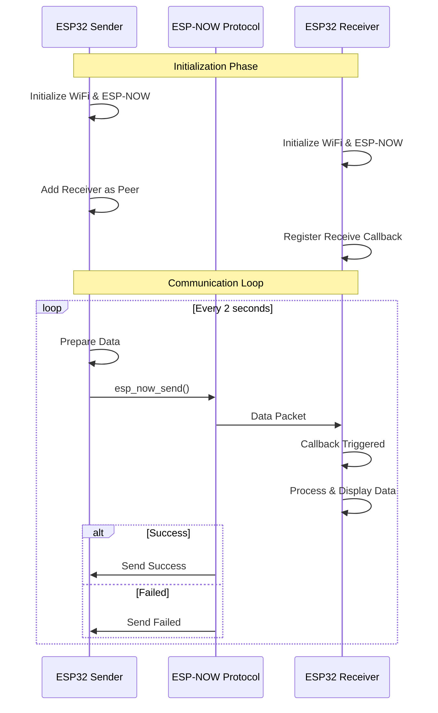

```mermaid
gantt
    title ESP-NOW Testing Timeline
    dateFormat X
    axisFormat %s
    
    section Preparation
    Setup Receiver    :done, prep1, 0, 30s
    Note MAC Address  :done, prep2, after prep1, 5s
    Setup Sender      :done, prep3, after prep2, 30s
    
    section Testing  
    Start Devices     :active, test1, after prep3, 5s
    Observe Communication :test2, after test1, 60s
    Verify Results    :test3, after test2, 10s
```

# บทที่ 3: การสื่อสารแบบ Point-to-Point
## ESP-NOW ระหว่าง ESP32 2 ตัว


ในบทนี้เราจะเรียนรู้การสื่อสารแบบ Point-to-Point ระหว่าง ESP32 2 ตัว โดยหนึ่งตัวเป็น **Sender** และอีกตัวเป็น **Receiver**

### เป้าหมายการเรียนรู้:
- เข้าใจการทำงานของ ESP-NOW API
- สร้าง Sender และ Receiver
- ส่งข้อมูลแบบ Two-way communication
- จัดการ MAC Address และ Peer Management
- ทำความเข้าใจ Callback Functions

---

## ทฤษฎี: ESP-NOW Point-to-Point Communication

### การทำงานของ ESP-NOW

```
ESP32 A (Sender)                    ESP32 B (Receiver)
      |                                    |
      |------ Data Packet (250 bytes) -----|
      |                                    |
      |<----- ACK/Status Callback --------|
```

### ขั้นตอนการทำงาน:

1. **Initialize WiFi** - เตรียม WiFi สำหรับ ESP-NOW
2. **Initialize ESP-NOW** - เริ่มต้น ESP-NOW protocol
3. **Add Peer** - เพิ่ม MAC address ของอุปกรณ์ที่ต้องการสื่อสาร
4. **Register Callbacks** - ลงทะเบียน function สำหรับรับส่งข้อมูล
5. **Send Data** - ส่งข้อมูลผ่าน ESP-NOW
6. **Receive Data** - รับข้อมูลและประมวลผล

### Key Concepts:

- **MAC Address**: ตัวระบุเฉพาะของแต่ละ ESP32
- **Peer**: อุปกรณ์ที่สามารถสื่อสารด้วย ESP-NOW ได้
- **Callback**: Function ที่เรียกเมื่อมี Event เกิดขึ้น
- **Channel**: ช่องสัญญาณ WiFi ที่ใช้สื่อสาร



### System Overview Diagram

**การทำงานของระบบ ESP-NOW Point-to-Point Communication:**

```
ESP32 Sender                                    ESP32 Receiver
├─ 1. WiFi Initialization                      ├─ 1. WiFi Initialization  
├─ 2. ESP-NOW Initialization                   ├─ 2. ESP-NOW Initialization
├─ 3. Add Receiver as Peer                     ├─ 3. Print MAC Address
├─ 4. Start Main Loop:                         ├─ 4. Register Receive Callback
│   ├─ Prepare Data (message, counter, sensor) └─ 5. Wait for Incoming Data
│   ├─ Send Data via ESP-NOW  ──────────────────────► Receive Callback
│   ├─ Check Send Status                            │   ├─ Parse MAC Address
│   ├─ Log Success/Error                            │   ├─ Extract Message  
│   ├─ Wait 2 seconds                               │   ├─ Log Counter Value
│   └─ Repeat Loop                                  │   └─ Display Sensor Data
```

**🔑 Key Points:**
- 📡 **Communication**: ESP-NOW protocol (max 250 bytes per packet)
- ⏱️ **Timing**: Sender transmits every 2 seconds  
- 🔄 **Process**: Receiver uses callback-based data handling
- 📍 **Addressing**: Uses MAC addresses for device identification

---

## โค้ด Sender (ESP32 ตัวที่ 1)

### Flow Diagram: ESP-NOW Sender Process

**ขั้นตอนการทำงานของ Sender:**

```
🚀 START
│
├─ Initialize NVS Flash
├─ Initialize WiFi 
├─ Initialize ESP-NOW
├─ Register Send Callback
├─ Add Peer (Receiver)
│
└─ 🔄 MAIN LOOP:
    │
    ├─ 📝 Prepare Data:
    │   ├─ Create message string
    │   ├─ Increment counter
    │   └─ Generate sensor value
    │
    ├─ 📤 Send Data:
    │   └─ esp_now_send(receiver_mac, data, size)
    │
    ├─ ✅❌ Check Result:
    │   ├─ Success → Log "Data sent successfully" 
    │   └─ Failed  → Log "Failed to send data"
    │
    ├─ ⏰ Wait 2 seconds
    │
    └─ 🔁 Back to Loop Start
```

**📊 Data Structure:**
- `message[200]` - Text message
- `counter` - Incremental number  
- `sensor_value` - Simulated sensor reading

### ไฟล์ main.c สำหรับ Sender:

```c
#include <stdio.h>
#include <stdlib.h>
#include <string.h>
#include "freertos/FreeRTOS.h"
#include "freertos/task.h"
#include "esp_system.h"
#include "esp_wifi.h"
#include "esp_event.h"
#include "esp_log.h"
#include "nvs_flash.h"
#include "esp_now.h"

static const char* TAG = "ESP_NOW_SENDER";

// MAC Address ของ Receiver (ต้องเปลี่ยนตามของจริง)
static uint8_t receiver_mac[6] = {0x24, 0x6F, 0x28, 0xAA, 0xBB, 0xCC};

// ข้อมูลที่จะส่ง
typedef struct {
    char message[200];
    int counter;
    float sensor_value;
} esp_now_data_t;

// Callback เมื่อส่งข้อมูลเสร็จ
void on_data_sent(const uint8_t *mac_addr, esp_now_send_status_t status) {
    if (status == ESP_NOW_SEND_SUCCESS) {
        ESP_LOGI(TAG, "✅ Data sent successfully");
    } else {
        ESP_LOGE(TAG, "❌ Failed to send data");
    }
}

// ฟังก์ชันเริ่มต้น WiFi
void wifi_init(void) {
    ESP_ERROR_CHECK(esp_netif_init());
    ESP_ERROR_CHECK(esp_event_loop_create_default());
    
    wifi_init_config_t cfg = WIFI_INIT_CONFIG_DEFAULT();
    ESP_ERROR_CHECK(esp_wifi_init(&cfg));
    ESP_ERROR_CHECK(esp_wifi_set_storage(WIFI_STORAGE_RAM));
    ESP_ERROR_CHECK(esp_wifi_set_mode(WIFI_MODE_STA));
    ESP_ERROR_CHECK(esp_wifi_start());
    
    ESP_LOGI(TAG, "WiFi initialized");
}

// ฟังก์ชันเริ่มต้น ESP-NOW
void espnow_init(void) {
    ESP_ERROR_CHECK(esp_now_init());
    ESP_ERROR_CHECK(esp_now_register_send_cb(on_data_sent));
    
    // เพิ่ม Peer (Receiver)
    esp_now_peer_info_t peer_info = {};
    memcpy(peer_info.peer_addr, receiver_mac, 6);
    peer_info.channel = 0;
    peer_info.encrypt = false;
    
    ESP_ERROR_CHECK(esp_now_add_peer(&peer_info));
    ESP_LOGI(TAG, "ESP-NOW initialized and peer added");
}

void app_main(void) {
    ESP_ERROR_CHECK(nvs_flash_init());
    
    wifi_init();
    espnow_init();
    
    esp_now_data_t send_data;
    int counter = 0;
    
    ESP_LOGI(TAG, "🚀 ESP-NOW Sender started");
    
    while (1) {
        // เตรียมข้อมูลที่จะส่ง
        sprintf(send_data.message, "Hello from Sender! Time: %d", counter);
        send_data.counter = counter++;
        send_data.sensor_value = 25.5 + (float)(counter % 10);
        
        // ส่งข้อมูล
        esp_err_t result = esp_now_send(receiver_mac, (uint8_t*)&send_data, sizeof(send_data));
        if (result == ESP_OK) {
            ESP_LOGI(TAG, "📤 Sending: %s (Counter: %d)", send_data.message, send_data.counter);
        } else {
            ESP_LOGE(TAG, "❌ Error sending data");
        }
        
        vTaskDelay(pdMS_TO_TICKS(2000)); // ส่งทุก 2 วินาที
    }
}
```

---

## โค้ด Receiver (ESP32 ตัวที่ 2)

### Flow Diagram: ESP-NOW Receiver Process

**ขั้นตอนการทำงานของ Receiver:**

```
🚀 START
│
├─ Initialize NVS Flash
├─ Initialize WiFi
├─ 📍 Print MAC Address (สำคัญ! ต้องคัดลอกไปใส่ใน Sender)
├─ Initialize ESP-NOW  
├─ Register Receive Callback
│
└─ 🎯 WAITING MODE:
    │
    │ 📡 [Waiting for incoming ESP-NOW data...]
    │
    └─ 📥 WHEN DATA RECEIVED:
        │
        ├─ 🔄 Callback Function Triggered:
        │   │
        │   ├─ 📋 Log Sender MAC Address
        │   ├─ 📨 Extract & Display Message
        │   ├─ 🔢 Show Counter Value
        │   ├─ 🌡️ Display Sensor Reading
        │   └─ 📦 Show Data Length
        │
        └─ 🔁 Return to Waiting Mode
```

**⚡ Event-Driven:** 
- Receiver ไม่มี active loop แต่ใช้ **callback mechanism**
- เมื่อมีข้อมูลเข้ามาจะเรียก `on_data_recv()` function ทันที
- ประหยัดพลังงานเพราะไม่ต้อง polling

### ไฟล์ main.c สำหรับ Receiver:

```c
#include <stdio.h>
#include <stdlib.h>
#include <string.h>
#include "freertos/FreeRTOS.h"
#include "freertos/task.h"
#include "esp_system.h"
#include "esp_wifi.h"
#include "esp_event.h"
#include "esp_log.h"
#include "nvs_flash.h"
#include "esp_now.h"

static const char* TAG = "ESP_NOW_RECEIVER";

// โครงสร้างข้อมูลที่รับ (ต้องเหมือนกับ Sender)
typedef struct {
    char message[200];
    int counter;
    float sensor_value;
} esp_now_data_t;

// Callback เมื่อรับข้อมูล
void on_data_recv(const uint8_t *mac_addr, const uint8_t *data, int len) {
    esp_now_data_t *recv_data = (esp_now_data_t*)data;
    
    ESP_LOGI(TAG, "📥 Received from: %02X:%02X:%02X:%02X:%02X:%02X", 
             mac_addr[0], mac_addr[1], mac_addr[2], 
             mac_addr[3], mac_addr[4], mac_addr[5]);
    
    ESP_LOGI(TAG, "📨 Message: %s", recv_data->message);
    ESP_LOGI(TAG, "🔢 Counter: %d", recv_data->counter);
    ESP_LOGI(TAG, "🌡️  Sensor Value: %.2f", recv_data->sensor_value);
    ESP_LOGI(TAG, "📦 Data Length: %d bytes", len);
    ESP_LOGI(TAG, "--------------------------------");
}

// ฟังก์ชันเริ่มต้น WiFi
void wifi_init(void) {
    ESP_ERROR_CHECK(esp_netif_init());
    ESP_ERROR_CHECK(esp_event_loop_create_default());
    
    wifi_init_config_t cfg = WIFI_INIT_CONFIG_DEFAULT();
    ESP_ERROR_CHECK(esp_wifi_init(&cfg));
    ESP_ERROR_CHECK(esp_wifi_set_storage(WIFI_STORAGE_RAM));
    ESP_ERROR_CHECK(esp_wifi_set_mode(WIFI_MODE_STA));
    ESP_ERROR_CHECK(esp_wifi_start());
    
    ESP_LOGI(TAG, "WiFi initialized");
}

// ฟังก์ชันเริ่มต้น ESP-NOW
void espnow_init(void) {
    ESP_ERROR_CHECK(esp_now_init());
    ESP_ERROR_CHECK(esp_now_register_recv_cb(on_data_recv));
    
    ESP_LOGI(TAG, "ESP-NOW initialized and ready to receive");
}

// ฟังก์ชันแสดง MAC Address
void print_mac_address(void) {
    uint8_t mac[6];
    esp_wifi_get_mac(WIFI_IF_STA, mac);
    ESP_LOGI(TAG, "📍 My MAC Address: %02X:%02X:%02X:%02X:%02X:%02X", 
             mac[0], mac[1], mac[2], mac[3], mac[4], mac[5]);
    ESP_LOGI(TAG, "⚠️  Copy this MAC to Sender code!");
}

void app_main(void) {
    ESP_ERROR_CHECK(nvs_flash_init());
    
    wifi_init();
    print_mac_address();
    espnow_init();
    
    ESP_LOGI(TAG, "🎯 ESP-NOW Receiver started - Waiting for data...");
    
    // Receiver จะทำงานใน callback ไม่ต้องมี loop
    while (1) {
        vTaskDelay(pdMS_TO_TICKS(1000));
    }
}
```

---

## ขั้นตอนการทดลอง

### 📝 เตรียมอุปกรณ์:
- ESP32 Development Board x 2 ตัว
- สาย USB x 2 เส้น (หรือใช้สลับกัน)
- คอมพิวเตอร์ที่ติดตั้ง ESP-IDF

### 🔧 ขั้นตอนการทำงาน:

#### ขั้นที่ 1: เตรียม Receiver
1. สร้างโปรเจคใหม่ชื่อ `espnow_receiver`
2. คัดลอกโค้ด Receiver ใส่ใน `main.c`
3. Build และ Flash ลง ESP32 ตัวที่ 1
4. เปิด Serial Monitor และจดบันทึก **MAC Address**

#### ขั้นที่ 2: เตรียม Sender  
1. สร้างโปรเจคใหม่ชื่อ `espnow_sender`
2. คัดลอกโค้ด Sender ใส่ใน `main.c`
3. **แก้ไข MAC Address** ในบรรทัดที่ 15:
   ```c
   static uint8_t receiver_mac[6] = {0x24, 0x6F, 0x28, 0xAA, 0xBB, 0xCC};
   //                               ↑ เปลี่ยนเป็น MAC ของ Receiver
   ```
4. Build และ Flash ลง ESP32 ตัวที่ 2

#### ขั้นที่ 3: ทดสอบการสื่อสาร
1. เปิด Serial Monitor ทั้ง 2 ตัว
2. Reset ESP32 ทั้งคู่
3. สังเกตการส่งและรับข้อมูล

### 📊 ผลลัพธ์ที่คาดหวัง:

**Sender Output:**

```
I (1234) ESP_NOW_SENDER: 🚀 ESP-NOW Sender started
I (2234) ESP_NOW_SENDER: 📤 Sending: Hello from Sender! Time: 0 (Counter: 0)
I (2334) ESP_NOW_SENDER: ✅ Data sent successfully
I (4234) ESP_NOW_SENDER: 📤 Sending: Hello from Sender! Time: 1 (Counter: 1)
```

**Receiver Output:**
```
I (1234) ESP_NOW_RECEIVER: 📍 My MAC Address: 24:6F:28:AA:BB:CC
I (2334) ESP_NOW_RECEIVER: 📥 Received from: AA:BB:CC:DD:EE:FF
I (2334) ESP_NOW_RECEIVER: 📨 Message: Hello from Sender! Time: 0
I (2334) ESP_NOW_RECEIVER: 🔢 Counter: 0
I (2334) ESP_NOW_RECEIVER: 🌡️ Sensor Value: 25.50
```



---

## การสื่อสารแบบ Two-Way (Bidirectional)

### Communication Flow: Two-Way System

**ลำดับการสื่อสารแบบ Bidirectional:**

```
Device A                           Device B
│                                  │
├─ 🔧 Initialize WiFi & ESP-NOW    ├─ 🔧 Initialize WiFi & ESP-NOW
├─ 👥 Add Device B as Peer         ├─ 👥 Add Device A as Peer  
│                                  │
├─ 🔄 Every 5 seconds:             ├─ 📡 Always Listening:
│   │                              │   │
│   ├─ 📤 Send Message             │   ├─ 📥 Receive Message
│   │   ├─ Device Name             │   │   ├─ Parse Data
│   │   ├─ Message Text            │   │   ├─ Log Details
│   │   ├─ Counter                 │   │   └─ Prepare Reply
│   │   └─ Timestamp               │   │
│   │                              │   ├─ 📤 Send Reply
│   ├─ 📥 Receive Reply ◄──────────┼───┤   ├─ "Reply to message #X"
│   │   ├─ Parse Reply             │   │   ├─ Same Counter
│   │   └─ Log Response            │   │   └─ New Timestamp
│   │                              │   │
│   └─ ⏰ Wait 5 seconds           │   └─ 🔁 Back to Listening
│                                  │
```

**🎯 Features:**
- ✅ **Bidirectional**: Both devices can send & receive
- ✅ **Auto-Reply**: Receiver automatically responds  
- ✅ **Timestamping**: Each message includes timestamp
- ✅ **Counter Tracking**: Messages are numbered for sequence

### โค้ด Two-Way Communication:

```c
#include <stdio.h>
#include <stdlib.h>
#include <string.h>
#include "freertos/FreeRTOS.h"
#include "freertos/task.h"
#include "esp_system.h"
#include "esp_wifi.h"
#include "esp_event.h"
#include "esp_log.h"
#include "nvs_flash.h"
#include "esp_now.h"

static const char* TAG = "ESP_NOW_BIDIRECTIONAL";

// MAC Address ของอีกตัว (ต้องเปลี่ยนตามของจริง)
static uint8_t partner_mac[6] = {0x24, 0x6F, 0x28, 0xAA, 0xBB, 0xCC};

// ข้อมูลที่ส่ง/รับ
typedef struct {
    char device_name[50];
    char message[150];
    int counter;
    uint32_t timestamp;
} bidirectional_data_t;

// Callback เมื่อส่งข้อมูลเสร็จ
void on_data_sent(const uint8_t *mac_addr, esp_now_send_status_t status) {
    if (status == ESP_NOW_SEND_SUCCESS) {
        ESP_LOGI(TAG, "✅ Message delivered successfully");
    } else {
        ESP_LOGE(TAG, "❌ Failed to deliver message");
    }
}

// Callback เมื่อรับข้อมูล
void on_data_recv(const uint8_t *mac_addr, const uint8_t *data, int len) {
    bidirectional_data_t *recv_data = (bidirectional_data_t*)data;
    
    ESP_LOGI(TAG, "📥 Received from %s:", recv_data->device_name);
    ESP_LOGI(TAG, "   💬 Message: %s", recv_data->message);
    ESP_LOGI(TAG, "   🔢 Counter: %d", recv_data->counter);
    ESP_LOGI(TAG, "   ⏰ Timestamp: %lu", recv_data->timestamp);
    
    // ตอบกลับข้อมูล
    bidirectional_data_t reply_data;
    strcpy(reply_data.device_name, "Device_B");
    sprintf(reply_data.message, "Reply to message #%d - Thanks!", recv_data->counter);
    reply_data.counter = recv_data->counter;
    reply_data.timestamp = esp_timer_get_time() / 1000; // milliseconds
    
    vTaskDelay(pdMS_TO_TICKS(100)); // หน่วงเวลาเล็กน้อย
    esp_now_send(mac_addr, (uint8_t*)&reply_data, sizeof(reply_data));
}

// ฟังก์ชันเริ่มต้น WiFi และ ESP-NOW
void init_espnow(void) {
    ESP_ERROR_CHECK(esp_netif_init());
    ESP_ERROR_CHECK(esp_event_loop_create_default());
    
    wifi_init_config_t cfg = WIFI_INIT_CONFIG_DEFAULT();
    ESP_ERROR_CHECK(esp_wifi_init(&cfg));
    ESP_ERROR_CHECK(esp_wifi_set_storage(WIFI_STORAGE_RAM));
    ESP_ERROR_CHECK(esp_wifi_set_mode(WIFI_MODE_STA));
    ESP_ERROR_CHECK(esp_wifi_start());
    
    ESP_ERROR_CHECK(esp_now_init());
    ESP_ERROR_CHECK(esp_now_register_send_cb(on_data_sent));
    ESP_ERROR_CHECK(esp_now_register_recv_cb(on_data_recv));
    
    // เพิ่ม Peer
    esp_now_peer_info_t peer_info = {};
    memcpy(peer_info.peer_addr, partner_mac, 6);
    peer_info.channel = 0;
    peer_info.encrypt = false;
    ESP_ERROR_CHECK(esp_now_add_peer(&peer_info));
    
    ESP_LOGI(TAG, "ESP-NOW bidirectional communication initialized");
}

void app_main(void) {
    ESP_ERROR_CHECK(nvs_flash_init());
    init_espnow();
    
    bidirectional_data_t send_data;
    int counter = 0;
    
    // แสดง MAC Address
    uint8_t mac[6];
    esp_wifi_get_mac(WIFI_IF_STA, mac);
    ESP_LOGI(TAG, "📍 My MAC: %02X:%02X:%02X:%02X:%02X:%02X", 
             mac[0], mac[1], mac[2], mac[3], mac[4], mac[5]);
    
    while (1) {
        // ส่งข้อมูล
        strcpy(send_data.device_name, "Device_A");
        sprintf(send_data.message, "Hello! This is message number %d", counter);
        send_data.counter = counter++;
        send_data.timestamp = esp_timer_get_time() / 1000;
        
        ESP_LOGI(TAG, "📤 Sending message #%d", send_data.counter);
        esp_now_send(partner_mac, (uint8_t*)&send_data, sizeof(send_data));
        
        vTaskDelay(pdMS_TO_TICKS(5000)); // ส่งทุก 5 วินาที
    }
}
```

### วิธีการใช้งาน:
1. Flash โค้ดนี้ลง ESP32 ทั้ง 2 ตัว
2. แก้ไข `partner_mac` ให้ตรงกับ MAC ของอีกตัว
3. เปลี่ยน `device_name` ให้แต่ละตัวมีชื่อต่างกัน
4. Reset ทั้งคู่และสังเกตการสื่อสาร

---

## การแก้ไขปัญหาเบื้องต้น

### ❌ ปัญหาที่พบบ่อย:

#### 1. "Peer not found" Error
**สาเหตุ:**
- MAC Address ไม่ถูกต้อง
- ไม่ได้เพิ่ม Peer ก่อนส่งข้อมูล

**วิธีแก้:**
```c
// ตรวจสอบการเพิ่ม Peer
esp_now_peer_info_t peer_info = {};
memcpy(peer_info.peer_addr, receiver_mac, 6);
peer_info.channel = 0;
peer_info.encrypt = false;
esp_err_t result = esp_now_add_peer(&peer_info);
if (result != ESP_OK) {
    ESP_LOGE(TAG, "Failed to add peer: %s", esp_err_to_name(result));
}
```

#### 2. ไม่มีข้อมูลส่งมา
**สาเหตุ:**
- WiFi Channel ไม่ตรงกัน
- ระยะทางไกลเกินไป
- การรบกวนสัญญาณ

**วิธีแก้:**
```c
// ตรวจสอบและตั้งค่า Channel
ESP_ERROR_CHECK(esp_wifi_set_channel(1, WIFI_SECOND_CHAN_NONE));
ESP_LOGI(TAG, "WiFi channel set to 1");
```

#### 3. ข้อมูลเพี้ยน (Corrupted Data)
**สาเหตุ:**
- ขนาด struct ไม่เหมือนกัน
- Alignment ของ struct

**วิธีแก้:**
```c
// เพิ่ม attribute เพื่อ alignment
typedef struct __attribute__((packed)) {
    char message[200];
    int counter;
    float sensor_value;
} esp_now_data_t;
```

### 🔍 การ Debug:

```c
// เพิ่มการ Debug ใน Callback
void on_data_sent(const uint8_t *mac_addr, esp_now_send_status_t status) {
    ESP_LOGI(TAG, "Send to: %02X:%02X:%02X:%02X:%02X:%02X", 
             mac_addr[0], mac_addr[1], mac_addr[2], 
             mac_addr[3], mac_addr[4], mac_addr[5]);
    ESP_LOGI(TAG, "Status: %s", (status == ESP_NOW_SEND_SUCCESS) ? "Success" : "Fail");
}

// ตรวจสอบข้อมูลที่รับ
void on_data_recv(const uint8_t *mac_addr, const uint8_t *data, int len) {
    ESP_LOGI(TAG, "Received %d bytes from: %02X:%02X:%02X:%02X:%02X:%02X", 
             len, mac_addr[0], mac_addr[1], mac_addr[2], 
             mac_addr[3], mac_addr[4], mac_addr[5]);
    
    // ตรวจสอบขนาดข้อมูล
    if (len != sizeof(esp_now_data_t)) {
        ESP_LOGW(TAG, "Received data size mismatch: %d != %d", len, sizeof(esp_now_data_t));
        return;
    }
}
```


```mermaid
flowchart TD
    A[ESP-NOW Communication Problem] --> B{Problem Type?}
    
    B -->|Peer Error| C[Check MAC Address]
    B -->|No Data| D[Check WiFi Channel]  
    B -->|Corrupted Data| E[Check Struct Alignment]
    B -->|Send Failed| F[Check Peer Registration]
    
    C --> G[Verify MAC in Receiver logs]
    D --> H[Set same channel on both devices]
    E --> I[Add __attribute__((packed))]
    F --> J[Add peer before sending]
    
    G --> K[Update MAC in sender code]
    H --> L[esp_wifi_set_channel()]
    I --> M[Rebuild both projects]
    J --> N[Check esp_now_add_peer() result]
    
    K --> O[Test Communication]
    L --> O
    M --> O
    N --> O
```


## แบบฝึกหัดเพิ่มเติม

### 🎯 Challenge 1: Remote LED Control
สร้างระบบควบคุม LED ด้วย ESP-NOW:

**Sender (Remote Controller):**
```c
// เพิ่มใน struct
typedef struct {
    bool led_state;
    int brightness; // 0-255
    char command[20];
} led_control_t;

// ในฟังก์ชัน main
led_control_t led_cmd;
led_cmd.led_state = true;
led_cmd.brightness = 128;
strcpy(led_cmd.command, "SET_LED");
esp_now_send(receiver_mac, (uint8_t*)&led_cmd, sizeof(led_cmd));
```

**Receiver (LED Controller):**
```c
void on_data_recv(const uint8_t *mac_addr, const uint8_t *data, int len) {
    led_control_t *cmd = (led_control_t*)data;
    
    if (strcmp(cmd->command, "SET_LED") == 0) {
        // ควบคุม LED
        gpio_set_level(LED_PIN, cmd->led_state);
        // ตั้งค่าความสว่าง (ถ้าใช้ PWM)
        ESP_LOGI(TAG, "LED: %s, Brightness: %d", 
                 cmd->led_state ? "ON" : "OFF", cmd->brightness);
    }
}
```

### 🎯 Challenge 2: Sensor Data Collection
สร้างระบบเก็บข้อมูลเซ็นเซอร์:

```c
typedef struct {
    float temperature;
    float humidity;
    int light_level;
    char sensor_id[10];
    uint32_t timestamp;
} sensor_data_t;

// Sender (Sensor Node)
sensor_data_t sensor;
sensor.temperature = 25.6;
sensor.humidity = 65.3;
sensor.light_level = 512;
strcpy(sensor.sensor_id, "TEMP_01");
sensor.timestamp = esp_timer_get_time() / 1000;
```

### 🎯 Challenge 3: Two-Way Chat System
สร้างระบบแชทระหว่าง ESP32:

```c
typedef struct {
    char sender_name[20];
    char message[200];
    uint32_t msg_id;
    bool is_ack;
} chat_message_t;

// ส่งข้อความ
chat_message_t msg;
strcpy(msg.sender_name, "ESP32_A");
strcpy(msg.message, "Hello ESP32_B!");
msg.msg_id = ++message_counter;
msg.is_ack = false;

// ตอบรับ (ACK)
chat_message_t ack;
strcpy(ack.sender_name, "ESP32_B");
strcpy(ack.message, "Message received!");
ack.msg_id = received_msg->msg_id;
ack.is_ack = true;
```

---

## สรุปและขั้นตอนต่อไป

### ✅ สิ่งที่ได้เรียนรู้ในบทนี้:
- การสื่อสารแบบ Point-to-Point ด้วย ESP-NOW
- การใช้งาน Callback Functions
- การจัดการ MAC Address และ Peer Management
- การส่งข้อมูลแบบ One-way และ Two-way
- การแก้ไขปัญหาเบื้องต้น

### 🎯 Key Points ที่ต้องจำ:
1. **MAC Address ต้องถูกต้อง** - ใช้คำสั่งแสดง MAC ใน Receiver
2. **Struct ต้องเหมือนกัน** - ระหว่าง Sender และ Receiver
3. **เพิ่ม Peer ก่อนส่ง** - ใช้ `esp_now_add_peer()`
4. **ข้อมูลสูงสุด 250 bytes** - ต่อ 1 packet
5. **ใช้ Callback** - สำหรับจัดการ Events

### 🔍 สิ่งที่ควรทดลองเพิ่มเติม:
- [ ] ทดสอบระยะทางการสื่อสาร
- [ ] ทดลองส่งข้อมูลหลายประเภท
- [ ] เพิ่มระบบ Error handling
- [ ] ทดสอบความเร็วในการส่งข้อมูล

### 🚀 บทต่อไป:
**Group Broadcasting** - เรียนรู้การส่งข้อมูลจาก 1 ตัวไปหลายตัว (One-to-Many)

**➡️ ไปที่: [04-Group-Broadcasting.md](04-Group-Broadcasting.md)**

---
*หมายเหตุ: ตรวจสอบให้แน่ใจว่าการสื่อสาร Point-to-Point ทำงานได้แล้วก่อนไปบทต่อไป*