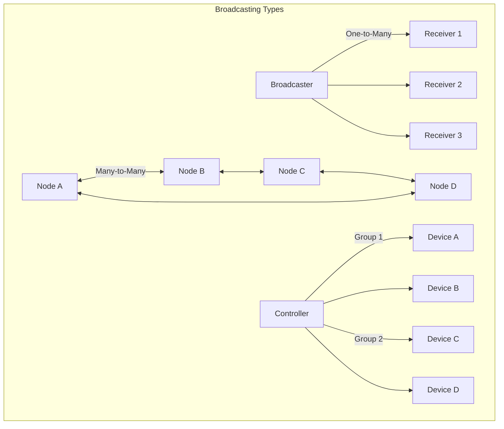
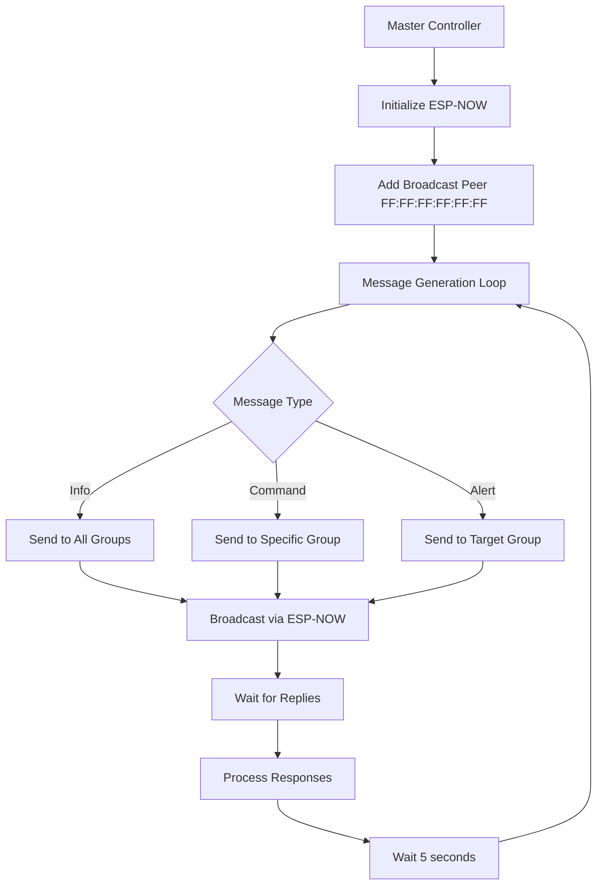
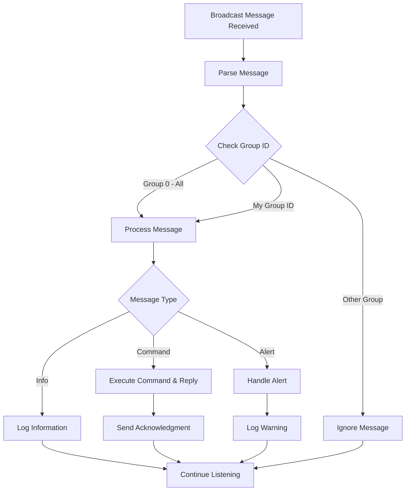
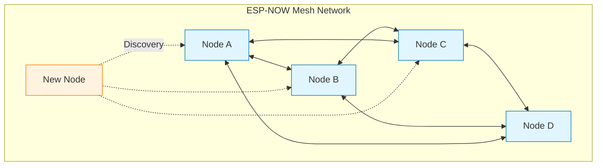

# บทที่ 4: การสื่อสารแบบ Broadcasting และ Group Communication
## ESP-NOW One-to-Many และ Many-to-Many


ในบทนี้เราจะเรียนรู้การสื่อสารแบบ **Broadcasting** และ **Group Communication** ที่ ESP32 หนึ่งตัวสามารถส่งข้อมูลไปยังหลายตัวพร้อมกัน

### เป้าหมายการเรียนรู้:
- สร้างระบบ One-to-Many Communication  
- ใช้งาน Broadcast Address
- สร้างระบบ Group Communication with IDs
- จัดการ Multiple Peers
- ส่งข้อมูลแบบ Multicast

---

## ทฤษฎี: Broadcasting vs Group Communication

### 1. Broadcasting (One-to-Many)
```
       Broadcaster (Master)
            |
    +-------+-------+
    |       |       |
Receiver1 Receiver2 Receiver3
```

- **Broadcast Address**: `FF:FF:FF:FF:FF:FF`
- ส่งข้อมูลไปยังทุกอุปกรณ์ที่อยู่ในระยะ
- ไม่ต้องรู้ MAC Address ของ Receiver

### 2. Group Communication (Many-to-Many)
```
    Node A ←→ Node B
      ↕        ↕
    Node D ←→ Node C
```

- ใช้ **Group ID** หรือ **Channel ID**
- แต่ละโหนดสามารถส่งและรับได้
- จัดการ Peers แบบ Dynamic

### 3. Multicast (Selective Broadcasting)
```
Controller → [Group 1: A, B]
          → [Group 2: C, D]
```

- ส่งไปยังกลุ่มเฉพาะ
- ใช้ Group ID หรือ Message Type filtering



---

## โค้ด Broadcaster (Master Node)

### Broadcasting System Architecture



### ไฟล์ main.c สำหรับ Broadcaster:

```c
#include <stdio.h>
#include <stdlib.h>
#include <string.h>
#include "freertos/FreeRTOS.h"
#include "freertos/task.h"
#include "esp_system.h"
#include "esp_wifi.h"
#include "esp_event.h"
#include "esp_log.h"
#include "nvs_flash.h"
#include "esp_now.h"

static const char* TAG = "ESP_NOW_BROADCASTER";

// Broadcast Address (ส่งให้ทุกคน)
static uint8_t broadcast_mac[6] = {0xFF, 0xFF, 0xFF, 0xFF, 0xFF, 0xFF};

// โครงสร้างข้อมูลที่ส่ง
typedef struct {
    char sender_id[20];
    char message[180];
    uint8_t message_type;  // 1=Info, 2=Command, 3=Alert
    uint8_t group_id;      // 0=All, 1=Group1, 2=Group2
    uint32_t sequence_num;
    uint32_t timestamp;
} broadcast_data_t;

static uint32_t sequence_counter = 0;

// Callback เมื่อส่งข้อมูลเสร็จ
void on_data_sent(const uint8_t *mac_addr, esp_now_send_status_t status) {
    if (status == ESP_NOW_SEND_SUCCESS) {
        ESP_LOGI(TAG, "✅ Broadcast successful to: %02X:%02X:%02X:%02X:%02X:%02X", 
                 mac_addr[0], mac_addr[1], mac_addr[2], 
                 mac_addr[3], mac_addr[4], mac_addr[5]);
    } else {
        ESP_LOGW(TAG, "❌ Broadcast failed to: %02X:%02X:%02X:%02X:%02X:%02X", 
                 mac_addr[0], mac_addr[1], mac_addr[2], 
                 mac_addr[3], mac_addr[4], mac_addr[5]);
    }
}

// Callback เมื่อรับข้อมูลตอบกลับ
void on_data_recv(const uint8_t *mac_addr, const uint8_t *data, int len) {
    ESP_LOGI(TAG, "📥 Reply from: %02X:%02X:%02X:%02X:%02X:%02X", 
             mac_addr[0], mac_addr[1], mac_addr[2], 
             mac_addr[3], mac_addr[4], mac_addr[5]);
    
    broadcast_data_t *reply = (broadcast_data_t*)data;
    ESP_LOGI(TAG, "   Reply: %s", reply->message);
}

// ฟังก์ชันเริ่มต้น WiFi และ ESP-NOW
void init_espnow(void) {
    ESP_ERROR_CHECK(esp_netif_init());
    ESP_ERROR_CHECK(esp_event_loop_create_default());
    
    wifi_init_config_t cfg = WIFI_INIT_CONFIG_DEFAULT();
    ESP_ERROR_CHECK(esp_wifi_init(&cfg));
    ESP_ERROR_CHECK(esp_wifi_set_storage(WIFI_STORAGE_RAM));
    ESP_ERROR_CHECK(esp_wifi_set_mode(WIFI_MODE_STA));
    ESP_ERROR_CHECK(esp_wifi_start());
    
    ESP_ERROR_CHECK(esp_now_init());
    ESP_ERROR_CHECK(esp_now_register_send_cb(on_data_sent));
    ESP_ERROR_CHECK(esp_now_register_recv_cb(on_data_recv));
    
    // เพิ่ม Broadcast Peer
    esp_now_peer_info_t peer_info = {};
    memcpy(peer_info.peer_addr, broadcast_mac, 6);
    peer_info.channel = 0;
    peer_info.encrypt = false;
    ESP_ERROR_CHECK(esp_now_add_peer(&peer_info));
    
    ESP_LOGI(TAG, "ESP-NOW Broadcasting initialized");
}

// ฟังก์ชันส่งข้อมูล Broadcast
void send_broadcast(const char* message, uint8_t msg_type, uint8_t group_id) {
    broadcast_data_t broadcast_data;
    
    strcpy(broadcast_data.sender_id, "MASTER_001");
    strncpy(broadcast_data.message, message, sizeof(broadcast_data.message) - 1);
    broadcast_data.message_type = msg_type;
    broadcast_data.group_id = group_id;
    broadcast_data.sequence_num = ++sequence_counter;
    broadcast_data.timestamp = esp_timer_get_time() / 1000; // ms
    
    ESP_LOGI(TAG, "📡 Broadcasting [Type:%d, Group:%d]: %s", 
             msg_type, group_id, message);
    
    esp_err_t result = esp_now_send(broadcast_mac, (uint8_t*)&broadcast_data, sizeof(broadcast_data));
    if (result != ESP_OK) {
        ESP_LOGE(TAG, "Failed to send broadcast: %s", esp_err_to_name(result));
    }
}

void app_main(void) {
    ESP_ERROR_CHECK(nvs_flash_init());
    init_espnow();
    
    // แสดง MAC Address
    uint8_t mac[6];
    esp_wifi_get_mac(WIFI_IF_STA, mac);
    ESP_LOGI(TAG, "📍 Broadcaster MAC: %02X:%02X:%02X:%02X:%02X:%02X", 
             mac[0], mac[1], mac[2], mac[3], mac[4], mac[5]);
    
    ESP_LOGI(TAG, "🚀 ESP-NOW Broadcaster started");
    
    int message_count = 0;
    
    while (1) {
        // ส่งข้อความประเภทต่างๆ
        switch (message_count % 4) {
            case 0:
                send_broadcast("General announcement to all devices", 1, 0); // Info to All
                break;
            case 1:
                send_broadcast("Command for Group 1 devices", 2, 1); // Command to Group 1
                break;
            case 2:
                send_broadcast("Alert for Group 2 devices", 3, 2); // Alert to Group 2
                break;
            case 3:
                send_broadcast("Status update for all groups", 1, 0); // Info to All
                break;
        }
        
        message_count++;
        vTaskDelay(pdMS_TO_TICKS(5000)); // ส่งทุก 5 วินาที
    }
}
```

---

## โค้ด Receiver Nodes (Client Nodes)

### Group Filtering Architecture



### ไฟล์ main.c สำหรับ Receiver:

```c
#include <stdio.h>
#include <stdlib.h>
#include <string.h>
#include "freertos/FreeRTOS.h"
#include "freertos/task.h"
#include "esp_system.h"
#include "esp_wifi.h"
#include "esp_event.h"
#include "esp_log.h"
#include "nvs_flash.h"
#include "esp_now.h"

static const char* TAG = "ESP_NOW_RECEIVER";

// กำหนด ID และ Group ของ Node นี้
#define MY_NODE_ID "NODE_001"
#define MY_GROUP_ID 1  // เปลี่ยนเป็น 1 หรือ 2 ตาม Group

// MAC ของ Broadcaster (ใส่ MAC จริงของ Master)
static uint8_t broadcaster_mac[6] = {0x24, 0x6F, 0x28, 0xAA, 0xBB, 0xCC};

// โครงสร้างข้อมูลเหมือน Broadcaster
typedef struct {
    char sender_id[20];
    char message[180];
    uint8_t message_type;  // 1=Info, 2=Command, 3=Alert
    uint8_t group_id;      // 0=All, 1=Group1, 2=Group2
    uint32_t sequence_num;
    uint32_t timestamp;
} broadcast_data_t;

// เก็บ sequence number ที่รับล่าสุด (ป้องกันการรับซ้ำ)
static uint32_t last_sequence = 0;

// Callback เมื่อรับข้อมูล Broadcast
void on_data_recv(const uint8_t *mac_addr, const uint8_t *data, int len) {
    broadcast_data_t *recv_data = (broadcast_data_t*)data;
    
    // ตรวจสอบ sequence number (ป้องกันการรับซ้ำ)
    if (recv_data->sequence_num <= last_sequence) {
        ESP_LOGW(TAG, "⚠️  Duplicate message ignored (seq: %lu)", recv_data->sequence_num);
        return;
    }
    last_sequence = recv_data->sequence_num;
    
    // ตรวจสอบว่าข้อความนี้สำหรับเราหรือไม่
    bool for_me = (recv_data->group_id == 0) || (recv_data->group_id == MY_GROUP_ID);
    
    if (!for_me) {
        ESP_LOGI(TAG, "📋 Message for Group %d (not for me)", recv_data->group_id);
        return;
    }
    
    // แสดงข้อมูลที่รับ
    ESP_LOGI(TAG, "📥 Received from %s:", recv_data->sender_id);
    ESP_LOGI(TAG, "   📨 Message: %s", recv_data->message);
    
    // แสดงประเภทข้อความ
    const char* msg_type_str;
    switch (recv_data->message_type) {
        case 1: msg_type_str = "INFO"; break;
        case 2: msg_type_str = "COMMAND"; break;
        case 3: msg_type_str = "ALERT"; break;
        default: msg_type_str = "UNKNOWN"; break;
    }
    ESP_LOGI(TAG, "   🏷️  Type: %s", msg_type_str);
    ESP_LOGI(TAG, "   👥 Group: %d", recv_data->group_id);
    ESP_LOGI(TAG, "   📊 Sequence: %lu", recv_data->sequence_num);
    
    // ประมวลผลตามประเภทข้อความ
    if (recv_data->message_type == 2) { // COMMAND
        ESP_LOGI(TAG, "🔧 Processing command...");
        // ใส่การประมวลผล Command ที่นี่
        
        // ส่งตอบกลับ
        send_reply(mac_addr, "Command received and processed");
    } else if (recv_data->message_type == 3) { // ALERT
        ESP_LOGW(TAG, "🚨 ALERT RECEIVED: %s", recv_data->message);
        // ใส่การจัดการ Alert ที่นี่
    }
    
    ESP_LOGI(TAG, "--------------------------------");
}

// ฟังก์ชันส่งตอบกลับไปยัง Broadcaster
void send_reply(const uint8_t* target_mac, const char* reply_message) {
    broadcast_data_t reply_data;
    
    strcpy(reply_data.sender_id, MY_NODE_ID);
    strncpy(reply_data.message, reply_message, sizeof(reply_data.message) - 1);
    reply_data.message_type = 1; // Info
    reply_data.group_id = MY_GROUP_ID;
    reply_data.sequence_num = 0; // Reply ไม่ต้องใช้ sequence
    reply_data.timestamp = esp_timer_get_time() / 1000;
    
    ESP_LOGI(TAG, "📤 Sending reply: %s", reply_message);
    esp_now_send(target_mac, (uint8_t*)&reply_data, sizeof(reply_data));
}

// Callback เมื่อส่งข้อมูลเสร็จ
void on_data_sent(const uint8_t *mac_addr, esp_now_send_status_t status) {
    ESP_LOGI(TAG, "Reply sent: %s", (status == ESP_NOW_SEND_SUCCESS) ? "✅" : "❌");
}

// ฟังก์ชันเริ่มต้น WiFi และ ESP-NOW
void init_espnow(void) {
    ESP_ERROR_CHECK(esp_netif_init());
    ESP_ERROR_CHECK(esp_event_loop_create_default());
    
    wifi_init_config_t cfg = WIFI_INIT_CONFIG_DEFAULT();
    ESP_ERROR_CHECK(esp_wifi_init(&cfg));
    ESP_ERROR_CHECK(esp_wifi_set_storage(WIFI_STORAGE_RAM));
    ESP_ERROR_CHECK(esp_wifi_set_mode(WIFI_MODE_STA));
    ESP_ERROR_CHECK(esp_wifi_start());
    
    ESP_ERROR_CHECK(esp_now_init());
    ESP_ERROR_CHECK(esp_now_register_recv_cb(on_data_recv));
    ESP_ERROR_CHECK(esp_now_register_send_cb(on_data_sent));
    
    // เพิ่ม Broadcaster เป็น Peer (สำหรับส่ง Reply)
    esp_now_peer_info_t peer_info = {};
    memcpy(peer_info.peer_addr, broadcaster_mac, 6);
    peer_info.channel = 0;
    peer_info.encrypt = false;
    ESP_ERROR_CHECK(esp_now_add_peer(&peer_info));
    
    ESP_LOGI(TAG, "ESP-NOW Receiver initialized");
}

void app_main(void) {
    ESP_ERROR_CHECK(nvs_flash_init());
    init_espnow();
    
    // แสดง Node Info
    uint8_t mac[6];
    esp_wifi_get_mac(WIFI_IF_STA, mac);
    ESP_LOGI(TAG, "📍 Node ID: %s", MY_NODE_ID);
    ESP_LOGI(TAG, "📍 Group ID: %d", MY_GROUP_ID);
    ESP_LOGI(TAG, "📍 MAC Address: %02X:%02X:%02X:%02X:%02X:%02X", 
             mac[0], mac[1], mac[2], mac[3], mac[4], mac[5]);
    
    ESP_LOGI(TAG, "🎯 ESP-NOW Receiver ready - Waiting for broadcasts...");
    
    // Receiver จะทำงานใน callback
    while (1) {
        vTaskDelay(pdMS_TO_TICKS(1000));
    }
}
```

---

## ขั้นตอนการทดลอง - Group Broadcasting

### 📝 เตรียมอุปกรณ์:
- ESP32 Development Board x 3-4 ตัว
- 1 ตัว = Broadcaster (Master)
- 2-3 ตัว = Receivers (Clients)

### 🔧 ขั้นตอนการตั้งค่า:

#### ขั้นที่ 1: Setup Broadcaster
1. สร้างโปรเจค `espnow_broadcaster`
2. คัดลอกโค้ด Broadcaster 
3. Build และ Flash ลง ESP32 ตัวแรก
4. จดบันทึก MAC Address ของ Broadcaster

#### ขั้นที่ 2: Setup Receiver Group 1
1. สร้างโปรเจค `espnow_receiver_g1`
2. คัดลอกโค้ด Receiver
3. แก้ไขการตั้งค่า:
   ```c
   #define MY_NODE_ID "NODE_G1_001"
   #define MY_GROUP_ID 1
   // แก้ broadcaster_mac ให้ตรงกับของจริง
   ```
4. Build และ Flash ลง ESP32 ตัวที่ 2

#### ขั้นที่ 3: Setup Receiver Group 2
1. สร้างโปรเจค `espnow_receiver_g2`
2. คัดลอกโค้ด Receiver
3. แก้ไขการตั้งค่า:
   ```c
   #define MY_NODE_ID "NODE_G2_001"
   #define MY_GROUP_ID 2
   ```
4. Build และ Flash ลง ESP32 ตัวที่ 3

#### ขั้นที่ 4: ทดสอบระบบ
1. เปิด Serial Monitor ทั้ง 3-4 ตัว
2. Reset ESP32 ทั้งหมด
3. สังเกตการส่งและรับข้อมูล

### 📊 ผลลัพธ์ที่คาดหวัง:

**Broadcaster Output:**
```
I (1234) ESP_NOW_BROADCASTER: 📡 Broadcasting [Type:1, Group:0]: General announcement
I (1334) ESP_NOW_BROADCASTER: ✅ Broadcast successful to: FF:FF:FF:FF:FF:FF
I (6234) ESP_NOW_BROADCASTER: 📡 Broadcasting [Type:2, Group:1]: Command for Group 1
I (6334) ESP_NOW_BROADCASTER: 📥 Reply from: 24:6F:28:11:22:33
```

**Group 1 Receiver Output:**
```
I (1334) ESP_NOW_RECEIVER: 📥 Received from MASTER_001:
I (1334) ESP_NOW_RECEIVER:    📨 Message: General announcement to all devices
I (1334) ESP_NOW_RECEIVER:    🏷️ Type: INFO
I (1334) ESP_NOW_RECEIVER:    👥 Group: 0
I (6334) ESP_NOW_RECEIVER: 📥 Received from MASTER_001:
I (6334) ESP_NOW_RECEIVER:    📨 Message: Command for Group 1 devices
I (6334) ESP_NOW_RECEIVER: 🔧 Processing command...
I (6434) ESP_NOW_RECEIVER: 📤 Sending reply: Command received and processed
```

**Group 2 Receiver Output:**
```
I (1334) ESP_NOW_RECEIVER: 📥 Received from MASTER_001:
I (1334) ESP_NOW_RECEIVER:    📨 Message: General announcement to all devices
I (6334) ESP_NOW_RECEIVER: 📋 Message for Group 1 (not for me)
I (11334) ESP_NOW_RECEIVER: 📥 Received from MASTER_001:
I (11334) ESP_NOW_RECEIVER:    📨 Message: Alert for Group 2 devices
I (11334) ESP_NOW_RECEIVER: 🚨 ALERT RECEIVED: Alert for Group 2 devices
```

---

## การสื่อสารแบบ Many-to-Many (Mesh Network)

### Mesh Network Architecture



### โค้ด Mesh Node (ทุกตัวเหมือนกัน):

```c
#include <stdio.h>
#include <stdlib.h>
#include <string.h>
#include "freertos/FreeRTOS.h"
#include "freertos/task.h"
#include "esp_system.h"
#include "esp_wifi.h"
#include "esp_event.h"
#include "esp_log.h"
#include "nvs_flash.h"
#include "esp_now.h"

static const char* TAG = "ESP_NOW_MESH";

// กำหนด Node ID (แก้ไขในแต่ละตัว)
#define MY_NODE_ID "MESH_NODE_A"

// Broadcast Address
static uint8_t broadcast_mac[6] = {0xFF, 0xFF, 0xFF, 0xFF, 0xFF, 0xFF};

// รายการ Peers ที่รู้จัก (แก้ไขตาม MAC จริง)
typedef struct {
    uint8_t mac[6];
    char node_id[20];
    bool is_active;
    uint32_t last_seen;
} peer_info_t;

#define MAX_PEERS 10
static peer_info_t known_peers[MAX_PEERS];
static int peer_count = 0;

// ข้อมูลที่ส่งในเครือข่าย Mesh
typedef struct {
    char sender_id[20];
    char target_id[20];     // "ALL" สำหรับ broadcast
    char message[150];
    uint8_t message_type;   // 1=Data, 2=Discovery, 3=Heartbeat
    uint32_t sequence_num;
    uint32_t timestamp;
    uint8_t hop_count;      // นับจำนวน hop (สำหรับ routing)
} mesh_data_t;

static uint32_t mesh_sequence = 0;

// ฟังก์ชันค้นหา Peer ใน List
int find_peer_by_mac(const uint8_t* mac) {
    for (int i = 0; i < peer_count; i++) {
        if (memcmp(known_peers[i].mac, mac, 6) == 0) {
            return i;
        }
    }
    return -1;
}

// ฟังก์ชันเพิ่ม Peer ใหม่
void add_peer(const uint8_t* mac, const char* node_id) {
    int index = find_peer_by_mac(mac);
    
    if (index >= 0) {
        // Update existing peer
        strcpy(known_peers[index].node_id, node_id);
        known_peers[index].is_active = true;
        known_peers[index].last_seen = esp_timer_get_time() / 1000;
    } else if (peer_count < MAX_PEERS) {
        // Add new peer
        memcpy(known_peers[peer_count].mac, mac, 6);
        strcpy(known_peers[peer_count].node_id, node_id);
        known_peers[peer_count].is_active = true;
        known_peers[peer_count].last_seen = esp_timer_get_time() / 1000;
        
        // เพิ่มใน ESP-NOW peer list
        esp_now_peer_info_t peer_info = {};
        memcpy(peer_info.peer_addr, mac, 6);
        peer_info.channel = 0;
        peer_info.encrypt = false;
        esp_now_add_peer(&peer_info);
        
        ESP_LOGI(TAG, "➕ Added peer: %s (%02X:%02X:%02X:%02X:%02X:%02X)", 
                 node_id, mac[0], mac[1], mac[2], mac[3], mac[4], mac[5]);
        peer_count++;
    }
}

// Callback เมื่อรับข้อมูล
void on_data_recv(const uint8_t *mac_addr, const uint8_t *data, int len) {
    mesh_data_t *recv_data = (mesh_data_t*)data;
    
    // เพิ่ม sender เป็น peer (ถ้ายังไม่รู้จัก)
    add_peer(mac_addr, recv_data->sender_id);
    
    ESP_LOGI(TAG, "📥 Received from %s:", recv_data->sender_id);
    ESP_LOGI(TAG, "   Target: %s", recv_data->target_id);
    ESP_LOGI(TAG, "   Message: %s", recv_data->message);
    ESP_LOGI(TAG, "   Hops: %d", recv_data->hop_count);
    
    // ตรวจสอบว่าข้อความนี้สำหรับเราหรือไม่
    bool for_me = (strcmp(recv_data->target_id, "ALL") == 0) || 
                  (strcmp(recv_data->target_id, MY_NODE_ID) == 0);
    
    if (for_me) {
        ESP_LOGI(TAG, "✅ Message processed");
        
        // ตอบกลับ (ถ้าไม่ใช่ broadcast)
        if (strcmp(recv_data->target_id, MY_NODE_ID) == 0) {
            send_mesh_message(recv_data->sender_id, "Message received!", 1);
        }
    } else {
        // Forward message (Mesh routing)
        if (recv_data->hop_count < 5) { // จำกัด hop count
            ESP_LOGI(TAG, "🔀 Forwarding message...");
            recv_data->hop_count++;
            esp_now_send(broadcast_mac, (uint8_t*)recv_data, sizeof(mesh_data_t));
        }
    }
}

// ฟังก์ชันส่งข้อความ Mesh
void send_mesh_message(const char* target, const char* message, uint8_t msg_type) {
    mesh_data_t mesh_msg;
    
    strcpy(mesh_msg.sender_id, MY_NODE_ID);
    strcpy(mesh_msg.target_id, target);
    strncpy(mesh_msg.message, message, sizeof(mesh_msg.message) - 1);
    mesh_msg.message_type = msg_type;
    mesh_msg.sequence_num = ++mesh_sequence;
    mesh_msg.timestamp = esp_timer_get_time() / 1000;
    mesh_msg.hop_count = 0;
    
    ESP_LOGI(TAG, "📤 Sending to %s: %s", target, message);
    esp_now_send(broadcast_mac, (uint8_t*)&mesh_msg, sizeof(mesh_msg));
}

// ฟังก์ชันส่ง Discovery message
void send_discovery(void) {
    char discovery_msg[150];
    sprintf(discovery_msg, "Discovery from %s - I am alive!", MY_NODE_ID);
    send_mesh_message("ALL", discovery_msg, 2);
}

// ฟังก์ชันแสดงรายการ Peers
void print_peer_list(void) {
    ESP_LOGI(TAG, "👥 Known Peers (%d):", peer_count);
    for (int i = 0; i < peer_count; i++) {
        ESP_LOGI(TAG, "   %s: %02X:%02X:%02X:%02X:%02X:%02X %s", 
                 known_peers[i].node_id,
                 known_peers[i].mac[0], known_peers[i].mac[1], 
                 known_peers[i].mac[2], known_peers[i].mac[3],
                 known_peers[i].mac[4], known_peers[i].mac[5],
                 known_peers[i].is_active ? "✅" : "❌");
    }
}

// Callback เมื่อส่งข้อมูลเสร็จ
void on_data_sent(const uint8_t *mac_addr, esp_now_send_status_t status) {
    // Silent - มี broadcast เยอะ ไม่ต้อง log
}

// ฟังก์ชันเริ่มต้น ESP-NOW
void init_espnow(void) {
    esp_netif_init();
    esp_event_loop_create_default();
    
    wifi_init_config_t cfg = WIFI_INIT_CONFIG_DEFAULT();
    esp_wifi_init(&cfg);
    esp_wifi_set_storage(WIFI_STORAGE_RAM);
    esp_wifi_set_mode(WIFI_MODE_STA);
    esp_wifi_start();
    
    esp_now_init();
    esp_now_register_recv_cb(on_data_recv);
    esp_now_register_send_cb(on_data_sent);
    
    // เพิ่ม Broadcast peer
    esp_now_peer_info_t peer_info = {};
    memcpy(peer_info.peer_addr, broadcast_mac, 6);
    peer_info.channel = 0;
    peer_info.encrypt = false;
    esp_now_add_peer(&peer_info);
    
    ESP_LOGI(TAG, "ESP-NOW Mesh initialized");
}

void app_main(void) {
    nvs_flash_init();
    init_espnow();
    
    uint8_t mac[6];
    esp_wifi_get_mac(WIFI_IF_STA, mac);
    ESP_LOGI(TAG, "🏷️  Node ID: %s", MY_NODE_ID);
    ESP_LOGI(TAG, "📍 MAC: %02X:%02X:%02X:%02X:%02X:%02X", 
             mac[0], mac[1], mac[2], mac[3], mac[4], mac[5]);
    
    ESP_LOGI(TAG, "🕸️  ESP-NOW Mesh Network started");
    
    int cycle = 0;
    
    while (1) {
        if (cycle % 6 == 0) {
            send_discovery(); // ทุก 30 วินาที
        } else if (cycle % 6 == 3) {
            print_peer_list(); // ทุก 30 วินาที (offset)
        }
        
        // ส่งข้อความทดสอบ
        if (cycle > 2 && cycle % 10 == 0) {
            char test_msg[100];
            sprintf(test_msg, "Test message #%d from %s", cycle/10, MY_NODE_ID);
            send_mesh_message("ALL", test_msg, 1);
        }
        
        cycle++;
        vTaskDelay(pdMS_TO_TICKS(5000)); // ทุก 5 วินาที
    }
}
```

### วิธีการใช้งาน:
1. Flash โค้ดนี้ลง ESP32 หลายตัว (3-5 ตัว)
2. แก้ไข `MY_NODE_ID` ให้แต่ละตัวต่างกัน
3. Reset ทั้งหมดและสังเกตการสร้างเครือข่าย Mesh

---

## เทคนิคขั้นสูงและการปรับปรุงประสิทธิภาพ

### 1. การจัดการ Sequence Number และ Duplicate Detection

```c
#define SEQUENCE_CACHE_SIZE 100
static uint32_t received_sequences[SEQUENCE_CACHE_SIZE];
static int sequence_index = 0;

bool is_duplicate_message(uint32_t sequence) {
    for (int i = 0; i < SEQUENCE_CACHE_SIZE; i++) {
        if (received_sequences[i] == sequence) {
            return true; // พบ sequence ซ้ำ
        }
    }
    
    // เพิ่ม sequence ใหม่
    received_sequences[sequence_index] = sequence;
    sequence_index = (sequence_index + 1) % SEQUENCE_CACHE_SIZE;
    return false;
}
```

### 2. การจัดการ Message Queue และ Buffer

```c
#define MESSAGE_QUEUE_SIZE 20

typedef struct {
    mesh_data_t data;
    uint8_t target_mac[6];
    uint32_t retry_count;
    uint32_t next_retry_time;
} queued_message_t;

static queued_message_t message_queue[MESSAGE_QUEUE_SIZE];
static int queue_head = 0, queue_tail = 0;

void add_to_queue(const mesh_data_t* data, const uint8_t* target_mac) {
    int next_tail = (queue_tail + 1) % MESSAGE_QUEUE_SIZE;
    if (next_tail != queue_head) {
        memcpy(&message_queue[queue_tail].data, data, sizeof(mesh_data_t));
        memcpy(message_queue[queue_tail].target_mac, target_mac, 6);
        message_queue[queue_tail].retry_count = 0;
        message_queue[queue_tail].next_retry_time = esp_timer_get_time() / 1000 + 1000;
        queue_tail = next_tail;
    }
}
```

### 3. การวัดคุณภาพสัญญาณ (RSSI Monitoring)

```c
typedef struct {
    int8_t rssi;
    uint32_t last_update;
    uint32_t packet_count;
    uint32_t failed_count;
} link_quality_t;

static link_quality_t peer_quality[MAX_PEERS];

void update_link_quality(int peer_index, int8_t rssi, bool success) {
    peer_quality[peer_index].rssi = rssi;
    peer_quality[peer_index].last_update = esp_timer_get_time() / 1000;
    peer_quality[peer_index].packet_count++;
    
    if (!success) {
        peer_quality[peer_index].failed_count++;
    }
    
    // คำนวณ success rate
    float success_rate = 1.0f - ((float)peer_quality[peer_index].failed_count / 
                                 peer_quality[peer_index].packet_count);
    
    ESP_LOGI(TAG, "Link quality to peer %d: RSSI=%d, Success=%.1f%%", 
             peer_index, rssi, success_rate * 100);
}
```

---

## สรุปและขั้นตอนต่อไป

### ✅ สิ่งที่ได้เรียนรู้ในบทนี้:
- การสื่อสารแบบ Broadcasting (One-to-Many)
- การใช้งาน Group Communication with Filtering
- การสร้างเครือข่าย Mesh (Many-to-Many)
- การจัดการ Multiple Peers
- เทคนิคการ Optimize ประสิทธิภาพ

### 🎯 Key Concepts ที่ต้องจำ:
1. **Broadcast Address** - `FF:FF:FF:FF:FF:FF` สำหรับส่งให้ทุกคน
2. **Group Filtering** - ใช้ Group ID เพื่อกรองข้อความ
3. **Sequence Number** - ป้องกันการรับข้อมูลซ้ำ
4. **Hop Count** - จำกัดการ Forward ใน Mesh network
5. **Peer Management** - การเพิ่ม/ลบ Peers แบบ Dynamic

### 🔍 การประยุกต์ใช้งาน:

#### 📡 Smart Home Automation:
```
Gateway → [Living Room Group]  → Lights, AC, TV
        → [Bedroom Group]      → Lights, Fan
        → [Kitchen Group]      → Appliances
```

#### 🏭 Industrial IoT:
```
Master Controller → [Zone A Sensors] → Temperature, Pressure
                 → [Zone B Sensors] → Vibration, Flow
                 → [All Zones]     → Emergency Stop
```

#### 🚗 Vehicle Communication:
```
Lead Vehicle → [Convoy] → Speed, Direction
            → [Safety] → Emergency Brake
```

### 🚀 บทต่อไป:
**Advanced Troubleshooting และ Optimization** - เรียนรู้การ Debug, การแก้ปัญหา และเทคนิคขั้นสูง

**➡️ ไปที่: [05-Advanced-Troubleshooting.md](05-Advanced-Troubleshooting.md)**

---
*หมายเหตุ: ทดสอบการส่ง Broadcasting ให้ทำงานได้ถูกต้องก่อนไปบทต่อไป*