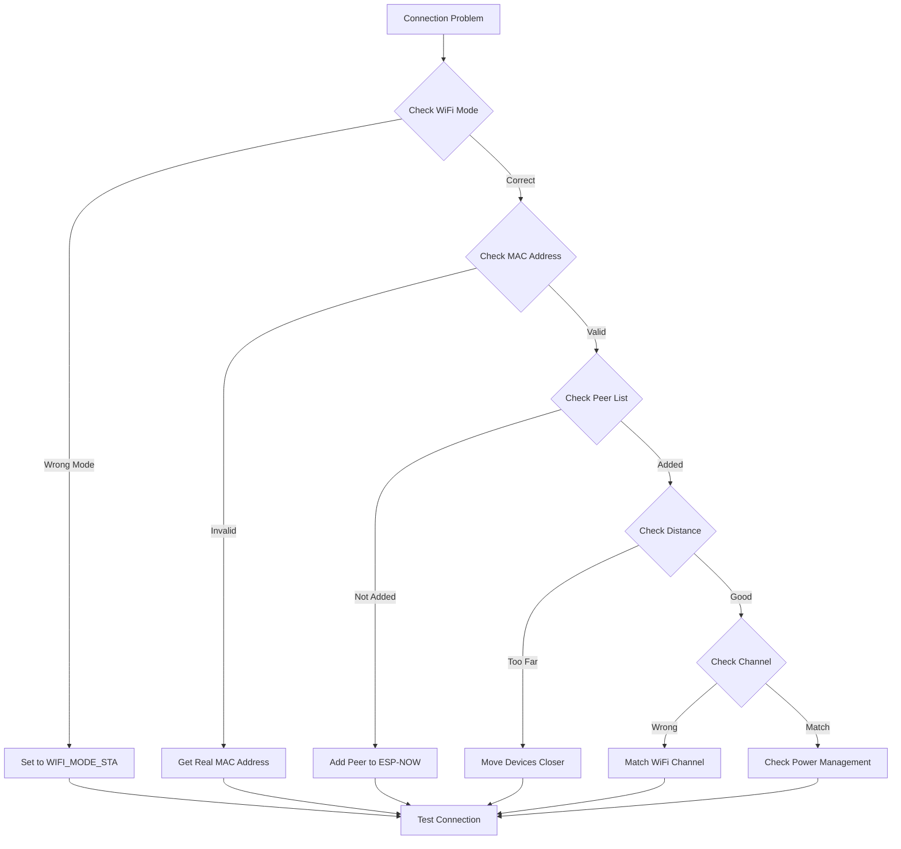
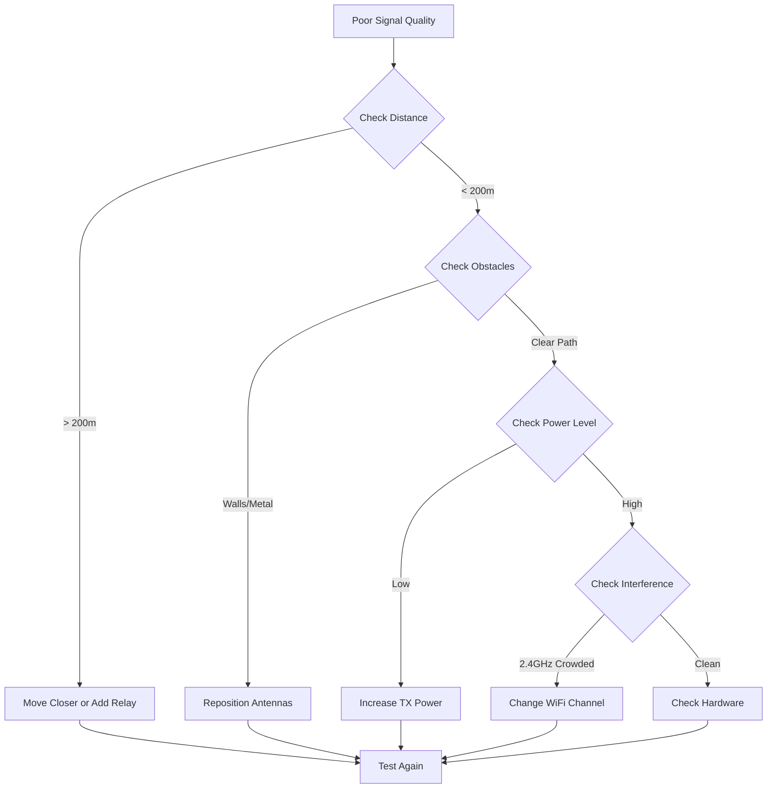

# บทที่ 5: Advanced Troubleshooting และ Optimization
## การแก้ปัญหาและปรับปรุงประสิทธิภาพ ESP-NOW


ในบทสุดท้ายนี้เราจะเรียนรู้เทคนิคขั้นสูงในการ **Debug**, **แก้ปัญหา** และ **ปรับปรุงประสิทธิภาพ** ของระบบ ESP-NOW

### เป้าหมายการเรียนรู้:
- วิเคราะห์และแก้ไขปัญหาที่พบบ่อย
- ใช้เครื่องมือ Debug และ Monitoring
- เพิ่มประสิทธิภาพการส่งข้อมูล
- จัดการ Power Management
- ปรับปรุงความเสถียรของระบบ

---

## การวิเคราะห์ปัญหาที่พบบ่อย

### 1. Connection Issues และการแก้ไข



### ตารางสาเหตุและวิธีแก้ไข:

| ปัญหา | สาเหตุ | วิธีแก้ไข |
|--------|--------|-----------|
| `ESP_ERR_ESPNOW_NOT_INIT` | ยังไม่เรียก `esp_now_init()` | เรียก `esp_now_init()` ก่อน |
| `ESP_ERR_ESPNOW_ARG` | MAC Address ผิด | ตรวจสอบ MAC Address |
| `ESP_ERR_ESPNOW_FULL` | Peer List เต็ม | ลบ Peer ที่ไม่ใช้ |
| `ESP_ERR_ESPNOW_NOT_FOUND` | ไม่พบ Peer | เพิ่ม Peer ก่อนส่ง |
| `ESP_ERR_ESPNOW_INTERNAL` | ข้อผิดพลาดภายใน | Restart ESP32 |

---

## เครื่องมือ Debug และ Monitoring

### 1. Advanced Logging System

```c
#include "esp_log.h"

// กำหนดระดับ Log ต่างๆ
static const char* TAG_MAIN = "ESP_NOW_MAIN";
static const char* TAG_SEND = "ESP_NOW_SEND";
static const char* TAG_RECV = "ESP_NOW_RECV";
static const char* TAG_DEBUG = "ESP_NOW_DEBUG";

// ฟังก์ชันแสดงข้อมูล ESP-NOW State
void print_espnow_stats(void) {
    // ข้อมูลสถิติ WiFi
    wifi_ap_record_t ap_info;
    if (esp_wifi_sta_get_ap_info(&ap_info) == ESP_OK) {
        ESP_LOGI(TAG_DEBUG, "📶 WiFi RSSI: %d dBm", ap_info.rssi);
        ESP_LOGI(TAG_DEBUG, "📡 Channel: %d", ap_info.primary);
    }
    
    // ข้อมูล Memory
    ESP_LOGI(TAG_DEBUG, "💾 Free Heap: %lu bytes", esp_get_free_heap_size());
    ESP_LOGI(TAG_DEBUG, "💾 Min Free Heap: %lu bytes", esp_get_minimum_free_heap_size());
    
    // ข้อมูล Task
    ESP_LOGI(TAG_DEBUG, "⚡ CPU Frequency: %lu MHz", esp_clk_cpu_freq() / 1000000);
    
    // แสดงจำนวน Peers
    esp_now_peer_num_t peer_num;
    esp_now_get_peer_num(&peer_num);
    ESP_LOGI(TAG_DEBUG, "👥 Total Peers: %d (Encrypted: %d)", 
             peer_num.total_num, peer_num.encrypt_num);
}

// ฟังก์ชันแสดงข้อมูล MAC Address
void print_mac_address(const uint8_t* mac, const char* label) {
    ESP_LOGI(TAG_DEBUG, "%s: %02X:%02X:%02X:%02X:%02X:%02X", 
             label, mac[0], mac[1], mac[2], mac[3], mac[4], mac[5]);
}

// ฟังก์ชันแสดงข้อมูลพื้นฐาน
void print_system_info(void) {
    esp_chip_info_t chip_info;
    esp_chip_info(&chip_info);
    
    ESP_LOGI(TAG_DEBUG, "🔧 ESP32 Chip Info:");
    ESP_LOGI(TAG_DEBUG, "   Model: %s", chip_info.model == CHIP_ESP32 ? "ESP32" : "Unknown");
    ESP_LOGI(TAG_DEBUG, "   Cores: %d", chip_info.cores);
    ESP_LOGI(TAG_DEBUG, "   Revision: %d", chip_info.revision);
    ESP_LOGI(TAG_DEBUG, "   Flash: %dMB %s", 
             spi_flash_get_chip_size() / (1024 * 1024),
             (chip_info.features & CHIP_FEATURE_EMB_FLASH) ? "embedded" : "external");
    
    // แสดง MAC Address
    uint8_t mac[6];
    esp_wifi_get_mac(WIFI_IF_STA, mac);
    print_mac_address(mac, "STA MAC");
    
    print_espnow_stats();
}
```

### 2. Packet Statistics และ Monitoring

```c
// โครงสร้างเก็บสถิติ
typedef struct {
    uint32_t packets_sent;
    uint32_t packets_received;
    uint32_t send_success;
    uint32_t send_failed;
    uint32_t duplicate_received;
    uint32_t invalid_packets;
    uint32_t last_reset_time;
    int8_t last_rssi;
    uint32_t total_bytes_sent;
    uint32_t total_bytes_received;
} espnow_stats_t;

static espnow_stats_t stats = {0};

// ฟังก์ชันอัพเดทสถิติ
void update_send_stats(bool success, size_t data_len) {
    stats.packets_sent++;
    stats.total_bytes_sent += data_len;
    
    if (success) {
        stats.send_success++;
    } else {
        stats.send_failed++;
    }
}

void update_recv_stats(size_t data_len, int8_t rssi, bool is_duplicate) {
    if (is_duplicate) {
        stats.duplicate_received++;
        return;
    }
    
    stats.packets_received++;
    stats.total_bytes_received += data_len;
    stats.last_rssi = rssi;
}

// ฟังก์ชันแสดงสถิติ
void print_statistics(void) {
    uint32_t uptime = (esp_timer_get_time() / 1000000) - stats.last_reset_time;
    
    ESP_LOGI(TAG_DEBUG, "📊 ESP-NOW Statistics (Uptime: %lu sec):", uptime);
    ESP_LOGI(TAG_DEBUG, "   📤 Sent: %lu packets (%lu bytes)", 
             stats.packets_sent, stats.total_bytes_sent);
    ESP_LOGI(TAG_DEBUG, "   📥 Received: %lu packets (%lu bytes)", 
             stats.packets_received, stats.total_bytes_received);
    ESP_LOGI(TAG_DEBUG, "   ✅ Success Rate: %.1f%%", 
             stats.packets_sent > 0 ? (float)stats.send_success * 100 / stats.packets_sent : 0);
    ESP_LOGI(TAG_DEBUG, "   🔄 Duplicates: %lu", stats.duplicate_received);
    ESP_LOGI(TAG_DEBUG, "   📶 Last RSSI: %d dBm", stats.last_rssi);
    
    if (uptime > 0) {
        ESP_LOGI(TAG_DEBUG, "   ⚡ TX Rate: %.1f pkt/sec, %.1f bytes/sec", 
                 (float)stats.packets_sent / uptime,
                 (float)stats.total_bytes_sent / uptime);
        ESP_LOGI(TAG_DEBUG, "   ⚡ RX Rate: %.1f pkt/sec, %.1f bytes/sec", 
                 (float)stats.packets_received / uptime,
                 (float)stats.total_bytes_received / uptime);
    }
}

// รีเซ็ตสถิติ
void reset_statistics(void) {
    memset(&stats, 0, sizeof(stats));
    stats.last_reset_time = esp_timer_get_time() / 1000000;
    ESP_LOGI(TAG_DEBUG, "📊 Statistics reset");
}
```

### 3. Network Discovery และ Diagnostics

```c
// ฟังก์ชันตรวจสอบการเชื่อมต่อกับ Peer
void ping_peer(const uint8_t* mac_addr) {
    typedef struct {
        char message[50];
        uint32_t timestamp;
        uint32_t sequence;
    } ping_data_t;
    
    static uint32_t ping_sequence = 0;
    ping_data_t ping_data;
    
    strcpy(ping_data.message, "PING");
    ping_data.timestamp = esp_timer_get_time() / 1000;
    ping_data.sequence = ++ping_sequence;
    
    ESP_LOGI(TAG_DEBUG, "🏓 Pinging peer...");
    esp_err_t result = esp_now_send(mac_addr, (uint8_t*)&ping_data, sizeof(ping_data));
    
    if (result == ESP_OK) {
        ESP_LOGI(TAG_DEBUG, "   Ping sent successfully");
    } else {
        ESP_LOGE(TAG_DEBUG, "   Ping failed: %s", esp_err_to_name(result));
    }
}

// ฟังก์ชันตรวจสอบคุณภาพสัญญาณ
void scan_wifi_environment(void) {
    wifi_scan_config_t scan_config = {
        .ssid = NULL,
        .bssid = NULL,
        .channel = 0,
        .show_hidden = true,
        .scan_type = WIFI_SCAN_TYPE_ACTIVE,
        .scan_time.active.min = 100,
        .scan_time.active.max = 300,
    };
    
    ESP_LOGI(TAG_DEBUG, "🔍 Scanning WiFi environment...");
    esp_wifi_scan_start(&scan_config, true);
    
    uint16_t ap_count = 0;
    esp_wifi_scan_get_ap_num(&ap_count);
    
    if (ap_count > 0) {
        wifi_ap_record_t *ap_records = malloc(sizeof(wifi_ap_record_t) * ap_count);
        esp_wifi_scan_get_ap_records(&ap_count, ap_records);
        
        ESP_LOGI(TAG_DEBUG, "📡 Found %d Access Points:", ap_count);
        for (int i = 0; i < ap_count; i++) {
            ESP_LOGI(TAG_DEBUG, "   %s (Ch:%d, RSSI:%d)", 
                     ap_records[i].ssid, ap_records[i].primary, ap_records[i].rssi);
        }
        
        free(ap_records);
    }
}

// ฟังก์ชันตรวจสอบ Channel congestion
void analyze_channel_usage(void) {
    ESP_LOGI(TAG_DEBUG, "📊 Analyzing channel usage...");
    
    for (int ch = 1; ch <= 13; ch++) {
        // สแกนแต่ละ channel
        wifi_scan_config_t scan_config = {
            .channel = ch,
            .show_hidden = true,
            .scan_type = WIFI_SCAN_TYPE_ACTIVE,
            .scan_time.active.min = 50,
            .scan_time.active.max = 100,
        };
        
        esp_wifi_scan_start(&scan_config, true);
        
        uint16_t ap_count = 0;
        esp_wifi_scan_get_ap_num(&ap_count);
        
        if (ap_count > 0) {
            ESP_LOGI(TAG_DEBUG, "   Channel %d: %d APs", ch, ap_count);
        }
        
        vTaskDelay(pdMS_TO_TICKS(100));
    }
}
```

---

## เทคนิคเพิ่มประสิทธิภาพ

### 1. Message Queuing และ Retry Mechanism

```c
#define MAX_QUEUE_SIZE 50
#define MAX_RETRY_COUNT 3
#define RETRY_DELAY_MS 100

typedef struct {
    uint8_t mac[6];
    uint8_t data[250];
    size_t data_len;
    uint32_t timestamp;
    uint8_t retry_count;
    bool in_use;
} message_queue_item_t;

static message_queue_item_t send_queue[MAX_QUEUE_SIZE];
static SemaphoreHandle_t queue_mutex;
static TaskHandle_t queue_task_handle;

// เพิ่มข้อความลงคิว
bool queue_message(const uint8_t* mac, const uint8_t* data, size_t len) {
    if (xSemaphoreTake(queue_mutex, pdMS_TO_TICKS(100)) != pdTRUE) {
        return false;
    }
    
    // หา slot ว่าง
    for (int i = 0; i < MAX_QUEUE_SIZE; i++) {
        if (!send_queue[i].in_use) {
            memcpy(send_queue[i].mac, mac, 6);
            memcpy(send_queue[i].data, data, len);
            send_queue[i].data_len = len;
            send_queue[i].timestamp = esp_timer_get_time() / 1000;
            send_queue[i].retry_count = 0;
            send_queue[i].in_use = true;
            
            xSemaphoreGive(queue_mutex);
            return true;
        }
    }
    
    xSemaphoreGive(queue_mutex);
    ESP_LOGW(TAG_SEND, "⚠️  Send queue full!");
    return false;
}

// Task ประมวลผลคิว
void queue_task(void *param) {
    while (1) {
        if (xSemaphoreTake(queue_mutex, pdMS_TO_TICKS(10)) == pdTRUE) {
            uint32_t current_time = esp_timer_get_time() / 1000;
            
            for (int i = 0; i < MAX_QUEUE_SIZE; i++) {
                if (send_queue[i].in_use) {
                    // ตรวจสอบเวลาส่ง
                    if (current_time - send_queue[i].timestamp >= RETRY_DELAY_MS) {
                        esp_err_t result = esp_now_send(send_queue[i].mac, 
                                                       send_queue[i].data, 
                                                       send_queue[i].data_len);
                        
                        if (result == ESP_OK) {
                            send_queue[i].in_use = false; // ส่งสำเร็จ
                        } else {
                            send_queue[i].retry_count++;
                            send_queue[i].timestamp = current_time;
                            
                            if (send_queue[i].retry_count >= MAX_RETRY_COUNT) {
                                ESP_LOGW(TAG_SEND, "❌ Message dropped after %d retries", 
                                        MAX_RETRY_COUNT);
                                send_queue[i].in_use = false;
                            }
                        }
                    }
                }
            }
            
            xSemaphoreGive(queue_mutex);
        }
        
        vTaskDelay(pdMS_TO_TICKS(10));
    }
}

// เริ่มต้นระบบคิว
void init_message_queue(void) {
    queue_mutex = xSemaphoreCreateMutex();
    memset(send_queue, 0, sizeof(send_queue));
    
    xTaskCreate(queue_task, "queue_task", 2048, NULL, 5, &queue_task_handle);
    ESP_LOGI(TAG_MAIN, "✅ Message queue initialized");
}
```

### 2. Adaptive Transmission Rate

```c
typedef struct {
    uint8_t mac[6];
    uint32_t success_count;
    uint32_t fail_count;
    uint32_t last_success_time;
    uint32_t transmission_interval; // ms
    int8_t rssi;
} peer_performance_t;

#define MAX_PEERS 20
static peer_performance_t peer_perf[MAX_PEERS];
static int peer_perf_count = 0;

// อัพเดทประสิทธิภาพ peer
void update_peer_performance(const uint8_t* mac, bool success, int8_t rssi) {
    int peer_index = -1;
    
    // หา peer ในรายการ
    for (int i = 0; i < peer_perf_count; i++) {
        if (memcmp(peer_perf[i].mac, mac, 6) == 0) {
            peer_index = i;
            break;
        }
    }
    
    // เพิ่ม peer ใหม่
    if (peer_index == -1 && peer_perf_count < MAX_PEERS) {
        peer_index = peer_perf_count++;
        memcpy(peer_perf[peer_index].mac, mac, 6);
        peer_perf[peer_index].transmission_interval = 1000; // เริ่มต้น 1 วินาที
    }
    
    if (peer_index >= 0) {
        peer_perf[peer_index].rssi = rssi;
        
        if (success) {
            peer_perf[peer_index].success_count++;
            peer_perf[peer_index].last_success_time = esp_timer_get_time() / 1000;
            
            // ลดช่วง transmission ถ้าสัญญาณดี
            if (rssi > -50 && peer_perf[peer_index].transmission_interval > 500) {
                peer_perf[peer_index].transmission_interval -= 100;
            }
        } else {
            peer_perf[peer_index].fail_count++;
            
            // เพิ่มช่วง transmission ถ้าสัญญาณแย่
            if (rssi < -70 && peer_perf[peer_index].transmission_interval < 5000) {
                peer_perf[peer_index].transmission_interval += 200;
            }
        }
        
        // คำนวณ success rate
        uint32_t total = peer_perf[peer_index].success_count + peer_perf[peer_index].fail_count;
        float success_rate = (float)peer_perf[peer_index].success_count / total;
        
        ESP_LOGI(TAG_DEBUG, "Peer %02X:%02X:**, Rate: %.1f%%, Interval: %lums", 
                 mac[0], mac[1], success_rate * 100, 
                 peer_perf[peer_index].transmission_interval);
    }
}

// ฟังก์ชันได้รับ transmission interval สำหรับ peer
uint32_t get_transmission_interval(const uint8_t* mac) {
    for (int i = 0; i < peer_perf_count; i++) {
        if (memcmp(peer_perf[i].mac, mac, 6) == 0) {
            return peer_perf[i].transmission_interval;
        }
    }
    return 1000; // default 1 วินาที
}
```

### 3. Power Management และ Sleep Modes

```c
#include "esp_pm.h"
#include "esp_sleep.h"

// การตั้งค่า Power Management
void init_power_management(void) {
    esp_pm_config_esp32_t pm_config = {
        .max_freq_mhz = 240,
        .min_freq_mhz = 80,
        .light_sleep_enable = true
    };
    
    esp_err_t result = esp_pm_configure(&pm_config);
    if (result == ESP_OK) {
        ESP_LOGI(TAG_MAIN, "🔋 Power management enabled");
    } else {
        ESP_LOGW(TAG_MAIN, "⚠️  Power management failed: %s", esp_err_to_name(result));
    }
}

// ฟังก์ชัน Deep Sleep สำหรับ Battery-powered devices
void enter_deep_sleep(uint32_t sleep_time_sec) {
    ESP_LOGI(TAG_MAIN, "💤 Entering deep sleep for %lu seconds", sleep_time_sec);
    
    // บันทึกข้อมูลสำคัญลง RTC memory
    esp_sleep_enable_timer_wakeup(sleep_time_sec * 1000000ULL);
    
    // ปิด WiFi ก่อน sleep
    esp_wifi_stop();
    
    // เข้า Deep Sleep
    esp_deep_sleep_start();
}

// ฟังก์ชัน Light Sleep ระหว่างรอข้อมูล
void light_sleep(uint32_t sleep_time_ms) {
    ESP_LOGI(TAG_DEBUG, "😴 Light sleep for %lums", sleep_time_ms);
    vTaskDelay(pdMS_TO_TICKS(sleep_time_ms));
}

// การจัดการ Battery monitoring
void monitor_battery(void) {
    // อ่าน ADC สำหรับแบตเตอรี่ (ถ้ามี)
    // ตัวอย่างการใช้งาน ADC1_CHANNEL_0 (GPIO36)
    
    adc1_config_width(ADC_WIDTH_BIT_12);
    adc1_config_channel_atten(ADC1_CHANNEL_0, ADC_ATTEN_DB_11);
    
    int adc_value = adc1_get_raw(ADC1_CHANNEL_0);
    float voltage = (adc_value * 3.3) / 4095.0;
    
    ESP_LOGI(TAG_DEBUG, "🔋 Battery voltage: %.2fV (ADC: %d)", voltage, adc_value);
    
    // ตรวจสอบแบตเตอรี่ต่ำ
    if (voltage < 3.2) {
        ESP_LOGW(TAG_MAIN, "⚠️  Low battery! Entering power save mode");
        
        // ลดความถี่ส่งข้อมูล
        // หรือเข้า Deep Sleep
    }
}
```

---

## การจัดการ Security และ Encryption

### 1. Message Authentication

```c
#include "mbedtls/md.h"
#include "mbedtls/sha256.h"

// คีย์สำหรับ Authentication (เปลี่ยนให้เป็นค่าลับ)
static const char* AUTH_KEY = "MySecretKey2024!";

// ฟังก์ชันสร้าง Hash สำหรับ Authentication
void calculate_message_hash(const uint8_t* data, size_t data_len, uint8_t* hash) {
    mbedtls_md_context_t ctx;
    const mbedtls_md_info_t* info = mbedtls_md_info_from_type(MBEDTLS_MD_SHA256);
    
    mbedtls_md_init(&ctx);
    mbedtls_md_setup(&ctx, info, 1); // 1 = HMAC mode
    mbedtls_md_hmac_starts(&ctx, (const unsigned char*)AUTH_KEY, strlen(AUTH_KEY));
    mbedtls_md_hmac_update(&ctx, data, data_len);
    mbedtls_md_hmac_finish(&ctx, hash);
    mbedtls_md_free(&ctx);
}

// ตรวจสอบความถูกต้องของข้อความ
bool verify_message_auth(const uint8_t* data, size_t data_len, const uint8_t* received_hash) {
    uint8_t calculated_hash[32];
    calculate_message_hash(data, data_len, calculated_hash);
    
    return memcmp(calculated_hash, received_hash, 32) == 0;
}

// โครงสร้างข้อมูลที่มี Authentication
typedef struct {
    char sender_id[20];
    char message[180];
    uint32_t timestamp;
    uint32_t sequence;
    uint8_t hash[32]; // SHA256 hash
} secure_message_t;

// ส่งข้อความที่มี Authentication
void send_secure_message(const uint8_t* target_mac, const char* message) {
    secure_message_t secure_msg;
    
    strcpy(secure_msg.sender_id, "SECURE_NODE");
    strncpy(secure_msg.message, message, sizeof(secure_msg.message) - 1);
    secure_msg.timestamp = esp_timer_get_time() / 1000;
    secure_msg.sequence = esp_random();
    
    // คำนวณ hash (ไม่รวม hash field)
    calculate_message_hash((uint8_t*)&secure_msg, 
                          sizeof(secure_msg) - sizeof(secure_msg.hash),
                          secure_msg.hash);
    
    ESP_LOGI(TAG_SEND, "🔒 Sending secure message");
    esp_now_send(target_mac, (uint8_t*)&secure_msg, sizeof(secure_msg));
}
```

### 2. Simple Encryption (XOR Cipher)

```c
// Simple XOR encryption (สำหรับการป้องกันพื้นฐาน)
void encrypt_decrypt_xor(uint8_t* data, size_t len, const char* key) {
    size_t key_len = strlen(key);
    
    for (size_t i = 0; i < len; i++) {
        data[i] ^= key[i % key_len];
    }
}

// ส่งข้อความที่เข้ารหัส
void send_encrypted_message(const uint8_t* target_mac, const char* message) {
    char encrypted_msg[200];
    strcpy(encrypted_msg, message);
    
    // เข้ารหัสข้อความ
    encrypt_decrypt_xor((uint8_t*)encrypted_msg, strlen(encrypted_msg), AUTH_KEY);
    
    ESP_LOGI(TAG_SEND, "🔐 Sending encrypted message");
    esp_now_send(target_mac, (uint8_t*)encrypted_msg, strlen(message) + 1);
}

// รับข้อความที่เข้ารหัส
void handle_encrypted_message(const uint8_t* data, size_t len) {
    char decrypted_msg[200];
    memcpy(decrypted_msg, data, len);
    
    // ถอดรหัสข้อความ
    encrypt_decrypt_xor((uint8_t*)decrypted_msg, len - 1, AUTH_KEY);
    
    ESP_LOGI(TAG_RECV, "🔓 Decrypted message: %s", decrypted_msg);
}
```

---

## การ Debug ขั้นสูง

### 1. Packet Analyzer และ Raw Data Inspection

```c
// ฟังก์ชันแสดงข้อมูล Raw ของ Packet
void dump_packet_hex(const uint8_t* data, size_t len, const char* label) {
    ESP_LOGI(TAG_DEBUG, "📦 %s (%d bytes):", label, len);
    
    for (size_t i = 0; i < len; i += 16) {
        char hex_line[64] = {0};
        char ascii_line[17] = {0};
        
        // สร้าง hex representation
        for (size_t j = 0; j < 16 && (i + j) < len; j++) {
            sprintf(hex_line + (j * 3), "%02X ", data[i + j]);
            
            // ASCII representation
            if (data[i + j] >= 32 && data[i + j] <= 126) {
                ascii_line[j] = data[i + j];
            } else {
                ascii_line[j] = '.';
            }
        }
        
        ESP_LOGI(TAG_DEBUG, "   %04X: %-48s |%s|", i, hex_line, ascii_line);
    }
}

// Callback ที่แสดงข้อมูลรายละเอียด
void debug_recv_callback(const uint8_t *mac_addr, const uint8_t *data, int len) {
    ESP_LOGI(TAG_DEBUG, "🔍 Detailed packet analysis:");
    
    // แสดง MAC Address
    print_mac_address(mac_addr, "Sender MAC");
    
    // แสดงเวลา
    uint32_t timestamp = esp_timer_get_time() / 1000;
    ESP_LOGI(TAG_DEBUG, "⏰ Received at: %lu ms", timestamp);
    
    // แสดงข้อมูล Raw
    dump_packet_hex(data, len, "Raw Data");
    
    // พยายามแปลงเป็น string
    char str_data[251] = {0};
    memcpy(str_data, data, len < 250 ? len : 250);
    ESP_LOGI(TAG_DEBUG, "📄 As String: %s", str_data);
    
    // เรียก callback หลัก
    // original_recv_callback(mac_addr, data, len);
}
```

### 2. Performance Profiling

```c
#include "esp_timer.h"

typedef struct {
    const char* function_name;
    uint32_t call_count;
    uint64_t total_time_us;
    uint64_t max_time_us;
    uint64_t min_time_us;
} profiler_data_t;

#define MAX_PROFILER_ENTRIES 20
static profiler_data_t profiler[MAX_PROFILER_ENTRIES];
static int profiler_count = 0;

// Macro สำหรับ profiling
#define PROFILE_START(name) \
    uint64_t prof_start_##name = esp_timer_get_time(); \
    static int prof_index_##name = -1;

#define PROFILE_END(name) \
    do { \
        uint64_t prof_duration = esp_timer_get_time() - prof_start_##name; \
        if (prof_index_##name == -1) { \
            for (int i = 0; i < profiler_count; i++) { \
                if (strcmp(profiler[i].function_name, #name) == 0) { \
                    prof_index_##name = i; \
                    break; \
                } \
            } \
            if (prof_index_##name == -1 && profiler_count < MAX_PROFILER_ENTRIES) { \
                prof_index_##name = profiler_count++; \
                profiler[prof_index_##name].function_name = #name; \
                profiler[prof_index_##name].min_time_us = UINT64_MAX; \
            } \
        } \
        if (prof_index_##name >= 0) { \
            profiler_data_t* p = &profiler[prof_index_##name]; \
            p->call_count++; \
            p->total_time_us += prof_duration; \
            if (prof_duration > p->max_time_us) p->max_time_us = prof_duration; \
            if (prof_duration < p->min_time_us) p->min_time_us = prof_duration; \
        } \
    } while(0)

// ฟังก์ชันแสดงผลการ profiling
void print_profiler_results(void) {
    ESP_LOGI(TAG_DEBUG, "⚡ Performance Profile:");
    ESP_LOGI(TAG_DEBUG, "   %-20s %8s %12s %12s %12s", 
             "Function", "Calls", "Total(μs)", "Avg(μs)", "Max(μs)");
    
    for (int i = 0; i < profiler_count; i++) {
        profiler_data_t* p = &profiler[i];
        uint64_t avg_time = p->call_count > 0 ? p->total_time_us / p->call_count : 0;
        
        ESP_LOGI(TAG_DEBUG, "   %-20s %8lu %12llu %12llu %12llu", 
                 p->function_name, p->call_count, p->total_time_us, 
                 avg_time, p->max_time_us);
    }
}

// ตัวอย่างการใช้งาน profiling
void example_profiled_function(void) {
    PROFILE_START(example_func);
    
    // ทำงานที่ต้องการวัดประสิทธิภาพ
    vTaskDelay(pdMS_TO_TICKS(10));
    
    PROFILE_END(example_func);
}
```

---

## การ Troubleshooting ปัญหาเฉพาะ

### 1. การแก้ปัญหา Range และ Signal Issues



### 2. การแก้ปัญหา Memory Leaks

```c
// ฟังก์ชันตรวจสอบ Memory usage
void monitor_memory_usage(void) {
    static uint32_t last_free_heap = 0;
    uint32_t current_free_heap = esp_get_free_heap_size();
    uint32_t min_free_heap = esp_get_minimum_free_heap_size();
    
    if (last_free_heap > 0) {
        int32_t heap_change = current_free_heap - last_free_heap;
        
        ESP_LOGI(TAG_DEBUG, "💾 Memory Status:");
        ESP_LOGI(TAG_DEBUG, "   Current Free: %lu bytes", current_free_heap);
        ESP_LOGI(TAG_DEBUG, "   Minimum Free: %lu bytes", min_free_heap);
        ESP_LOGI(TAG_DEBUG, "   Change: %ld bytes", heap_change);
        
        if (heap_change < -1000) {
            ESP_LOGW(TAG_DEBUG, "⚠️  Possible memory leak detected!");
        }
    }
    
    last_free_heap = current_free_heap;
    
    // ตรวจสอบ Stack usage ของ Tasks
    TaskHandle_t current_task = xTaskGetCurrentTaskHandle();
    UBaseType_t stack_high_water = uxTaskGetStackHighWaterMark(current_task);
    ESP_LOGI(TAG_DEBUG, "   Stack remaining: %u bytes", stack_high_water * sizeof(StackType_t));
}
```

### 3. การจับปัญหา Timing Issues

```c
// ตรวจสอบ Timing ของการส่งข้อมูล
static uint32_t last_send_time = 0;
static uint32_t send_intervals[10];
static int interval_index = 0;

void track_send_timing(void) {
    uint32_t current_time = esp_timer_get_time() / 1000;
    
    if (last_send_time > 0) {
        uint32_t interval = current_time - last_send_time;
        send_intervals[interval_index] = interval;
        interval_index = (interval_index + 1) % 10;
        
        // คำนวณค่าเฉลี่ย
        uint32_t total = 0;
        for (int i = 0; i < 10; i++) {
            total += send_intervals[i];
        }
        uint32_t avg_interval = total / 10;
        
        ESP_LOGI(TAG_DEBUG, "⏱️  Send timing - Current: %lums, Avg: %lums", 
                 interval, avg_interval);
        
        // เตือนถ้า timing ผิดปกติ
        if (interval > avg_interval * 2) {
            ESP_LOGW(TAG_DEBUG, "⚠️  Unusual send delay detected!");
        }
    }
    
    last_send_time = current_time;
}
```

---

## เครื่องมือและคำสั่งที่มีประโยชน์

### 1. การใช้ idf.py สำหรับ Debug

```bash
# แสดง Log แบบ Colored และ Filtered
idf.py monitor --print_filter="ESP_NOW*"

# Monitor พร้อม Timestamp
idf.py monitor --timestamp

# Save log ลงไฟล์
idf.py monitor | tee espnow_debug.log

# Flash และ Monitor ในคำสั่งเดียว
idf.py flash monitor

# ตั้งค่า Log level
idf.py menuconfig
# Component config -> Log output -> Default log verbosity -> Debug

# ดู Memory usage แบบ realtime
idf.py monitor --print_filter="Memory*"
```

### 2. การวิเคราะห์ Core Dump

```bash
# Generate coredump (เมื่อเกิด panic)
idf.py coredump-info <coredump_file>

# วิเคราะห์ backtrace
idf.py monitor --decode-backtrace

# ดู Task status
idf.py monitor --print_filter="Task*"
```

### 3. การ Monitor Network Traffic

```c
// เปิดใช้งาน promiscuous mode เพื่อดู packets
void enable_packet_monitoring(void) {
    esp_wifi_set_promiscuous(true);
    esp_wifi_set_promiscuous_rx_cb([](void* buf, wifi_promiscuous_pkt_type_t type) {
        if (type == WIFI_PKT_DATA) {
            wifi_promiscuous_pkt_t* pkt = (wifi_promiscuous_pkt_t*)buf;
            ESP_LOGI(TAG_DEBUG, "📡 Packet: len=%d, rssi=%d", 
                     pkt->rx_ctrl.sig_len, pkt->rx_ctrl.rssi);
        }
    });
}
```

---

## สรุปและ Best Practices

### ✅ Checklist การ Debug ESP-NOW:

1. **การตั้งค่าพื้นฐาน:**
   - [ ] ตรวจสอบ WiFi Mode (ต้องเป็น STA หรือ APSTA)
   - [ ] ตรวจสอบ MAC Address ถูกต้อง
   - [ ] ตรวจสอบ Peer ถูกเพิ่มแล้ว

2. **การตรวจสอบสัญญาณ:**
   - [ ] วัดระยะห่างระหว่างอุปกรณ์
   - [ ] ตรวจสอบสิ่งกีดขวาง
   - [ ] วัด RSSI และคุณภาพสัญญาณ

3. **การจัดการข้อมูล:**
   - [ ] ตรวจสอบขนาดข้อมูล (< 250 bytes)
   - [ ] ใช้ Sequence number ป้องกันข้อมูลซ้ำ
   - [ ] จัดการ Timeout และ Retry

4. **Performance Optimization:**
   - [ ] ใช้ Message Queue
   - [ ] ปรับ Transmission rate ตาม Signal quality
   - [ ] เปิดใช้ Power management

### 🎯 Best Practices สำหรับการพัฒนา:

1. **Logging และ Debug:**
   ```c
   // ใช้ Log levels ที่เหมาะสม
   ESP_LOGE() // สำหรับ Error
   ESP_LOGW() // สำหรับ Warning  
   ESP_LOGI() // สำหรับ Information
   ESP_LOGD() // สำหรับ Debug (ปิดใน Production)
   ```

2. **Error Handling:**
   ```c
   esp_err_t result = esp_now_send(mac, data, len);
   if (result != ESP_OK) {
       ESP_LOGE(TAG, "Send failed: %s", esp_err_to_name(result));
       // จัดการ error
   }
   ```

3. **Memory Management:**
   ```c
   // ตรวจสอบ Memory อยู่เสมอ
   if (esp_get_free_heap_size() < 10000) {
       ESP_LOGW(TAG, "Low memory warning");
   }
   ```

4. **Security:**
   ```c
   // ใช้ Authentication และ Encryption
   // เปลี่ยน Default keys
   // ตรวจสอบ Message integrity
   ```

### 🚀 ขั้นตอนต่อไป:

1. **การประยุกต์ใช้จริง:**
   - IoT Home Automation
   - Industrial Monitoring
   - Vehicle-to-Vehicle Communication
   - Sensor Networks

2. **การพัฒนาต่อ:**
   - เรียนรู้ ESP-MESH Protocol
   - ผสานกับ WiFi และ Bluetooth
   - ใช้ Cloud integration
   - พัฒนา Mobile Apps

3. **การขยายระบบ:**
   - Multi-hop Routing
   - Load Balancing
   - Fault Tolerance
   - Scalability

---

## 🎓 สรุปการเรียนรู้ทั้งหมด

เราได้เรียนรู้ ESP-NOW ตั้งแต่:

1. **[บทที่ 1]** - พื้นฐานและทฤษฎี ESP-NOW
2. **[บทที่ 2]** - การตั้งค่า ESP-IDF และสร้างโปรเจคแรก  
3. **[บทที่ 3]** - การสื่อสารแบบ Point-to-Point
4. **[บทที่ 4]** - การสื่อสารแบบ Broadcasting และ Group
5. **[บทที่ 5]** - การแก้ปัญหาและปรับปรุงประสิทธิภาพ

### 💡 ความรู้หลักที่ได้รับ:
- การใช้งาน ESP-NOW Protocol
- การจัดการ Wireless Communication
- เทคนิค Debug และ Troubleshooting
- การเพิ่มประสิทธิภาพและความปลอดภัย
- การประยุกต์ใช้ในโครงการจริง

**🎉 ขอแสดงความยินดี! คุณพร้อมที่จะพัฒนาโครงการ ESP-NOW ได้แล้ว**

---
*หมายเหตุ: เอกสารนี้เป็นส่วนหนึ่งของหลักสูตร ESP-IDF และ ESP-NOW Development*