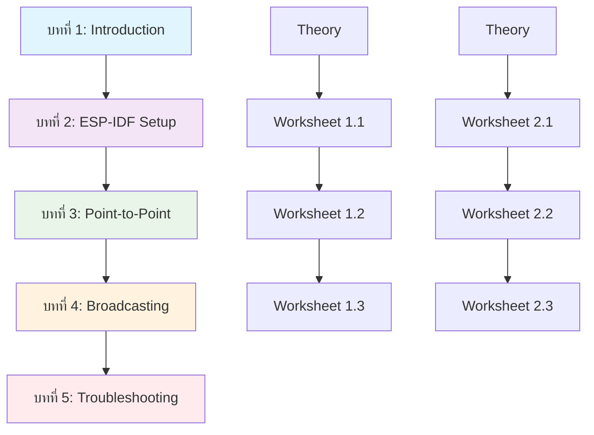

# ESP-NOW สำหรับ ESP32 ด้วย ESP-IDF
## หลักสูตรการเรียนรู้แบบครบครัน

ยินดีต้อนรับสู่หลักสูตรการเรียนรู้ ESP-NOW อย่างครบถ้วน! หลักสูตรนี้ได้รับการปรับปรุงใหม่โดยแยกทฤษฎีและภาคปฏิบัติออกจากกันเพื่อให้การเรียนรู้มีประสิทธิภาพมากขึ้น

---

## 📚 โครงสร้างหลักสูตร

หลักสูตรประกอบด้วย **5 บทหลัก** แต่ละบทมี:
- **ไฟล์หลัก:** เนื้อหาทฤษฎีและแนวคิด
- **ใบงานปฏิบัติ:** การทดลองและ hands-on exercises (อย่างน้อย 3 ใบต่อบท)

---

## 📖 บทเรียนทั้ง 5 บท

### [บทที่ 1: แนะนำ ESP-NOW](01-Introduction/)
**เนื้อหาหลัก:** [01-ESP-NOW-Introduction.md](01-Introduction/01-ESP-NOW-Introduction.md)

**🎯 เป้าหมาย:** ทำความเข้าใจพื้นฐาน ESP-NOW
- หลักการทำงานและคุณสมบัติ
- ข้อดี ข้อจำกัด และการประยุกต์ใช้
- เปรียบเทียบกับเทคโนโลยีอื่น
- สถาปัตยกรรมและโครงสร้าง

**📋 ใบงานปฏิบัติ:**
- [Worksheet 1.1: ESP-NOW Setup แรก](01-Introduction/Worksheets/Worksheet-1.1-ESP-NOW-Setup.md)
- [Worksheet 1.2: ทำความเข้าใจ Concepts](01-Introduction/Worksheets/Worksheet-1.2-Understanding-Concepts.md)
- [Worksheet 1.3: การวิเคราะห์ Architecture](01-Introduction/Worksheets/Worksheet-1.3-Architecture-Analysis.md)

---

### [บทที่ 2: การติดตั้งและตั้งค่า ESP-IDF](02-ESP-IDF-Setup/)
**เนื้อหาหลัก:** [02-ESP-IDF-Setup.md](02-ESP-IDF-Setup/02-ESP-IDF-Setup.md)

**🎯 เป้าหมาย:** เตรียมสภาพแวดล้อมการพัฒนา
- ติดตั้ง ESP-IDF บน Windows/macOS/Linux
- ตั้งค่า Command Line Environment
- สร้างและทดสอบโปรเจคแรก
- เข้าใจ idf.py commands

**📋 ใบงานปฏิบัติ:**
- [Worksheet 2.1: การติดตั้ง ESP-IDF](02-ESP-IDF-Setup/Worksheets/Worksheet-2.1-Installation.md)
- [Worksheet 2.2: การตั้งค่าและ Configuration](02-ESP-IDF-Setup/Worksheets/Worksheet-2.2-Configuration.md)
- [Worksheet 2.3: การสร้างโปรเจคแรก](02-ESP-IDF-Setup/Worksheets/Worksheet-2.3-First-Project.md)

---

### [บทที่ 3: การสื่อสารแบบ Point-to-Point](03-Point-to-Point/)
**เนื้อหาหลัก:** [03-Point-to-Point-Communication.md](03-Point-to-Point/03-Point-to-Point-Communication.md)

**🎯 เป้าหมาย:** การสื่อสารระหว่าง ESP32 2 ตัว
- การสร้าง Sender และ Receiver
- MAC Address และ Peer Management
- Callback Functions และ Error Handling
- Two-way Communication

**📋 ใบงานปฏิบัติ:**
- [Worksheet 3.1: Basic Sender/Receiver](03-Point-to-Point/Worksheets/Worksheet-3.1-Basic-Sender-Receiver.md)
- [Worksheet 3.2: Two-way Communication](03-Point-to-Point/Worksheets/Worksheet-3.2-Two-way-Communication.md)
- [Worksheet 3.3: Advanced Features](03-Point-to-Point/Worksheets/Worksheet-3.3-Advanced-Features.md)

---

### [บทที่ 4: การสื่อสารแบบ Broadcasting](04-Broadcasting/)
**เนื้อหาหลัก:** [04-Group-Broadcasting.md](04-Broadcasting/04-Group-Broadcasting.md)

**🎯 เป้าหมาย:** การสื่อสารแบบ One-to-Many และ Many-to-Many
- Broadcasting และ Multicast
- Group Communication with IDs
- Mesh Network พื้นฐาน
- การจัดการ Multiple Peers

**📋 ใบงานปฏิบัติ:**
- [Worksheet 4.1: Basic Broadcasting](04-Broadcasting/Worksheets/Worksheet-4.1-Basic-Broadcasting.md)
- [Worksheet 4.2: Group Communication](04-Broadcasting/Worksheets/Worksheet-4.2-Group-Communication.md)
- [Worksheet 4.3: Mesh Network](04-Broadcasting/Worksheets/Worksheet-4.3-Mesh-Network.md)

---

### [บทที่ 5: Advanced Troubleshooting](05-Troubleshooting/)
**เนื้อหาหลัก:** [05-Advanced-Troubleshooting.md](05-Troubleshooting/05-Advanced-Troubleshooting.md)

**🎯 เป้าหมาย:** การแก้ปัญหาและปรับปรุงประสิทธิภาพ
- เครื่องมือ Debug และ Monitoring
- Performance Optimization
- Power Management
- Security Implementation

**📋 ใบงานปฏิบัติ:**
- [Worksheet 5.1: Debugging Tools](05-Troubleshooting/Worksheets/Worksheet-5.1-Debugging-Tools.md)
- [Worksheet 5.2: Performance Optimization](05-Troubleshooting/Worksheets/Worksheet-5.2-Performance-Optimization.md)
- [Worksheet 5.3: Security Implementation](05-Troubleshooting/Worksheets/Worksheet-5.3-Security.md)

---

## 🎯 วิธีการใช้หลักสูตร

### สำหรับผู้สอน:
1. **เริ่มด้วยทฤษฎี:** อธิบายเนื้อหาจากไฟล์หลักของแต่ละบท
2. **ลงมือปฏิบัติ:** ให้นักเรียนทำใบงานตามลำดับ
3. **ตรวจสอบความเข้าใจ:** ใช้คำถามและแบบฝึกหัดในใบงาน
4. **ประเมินผล:** ใช้ Self-assessment ในแต่ละใบงาน

### สำหรับผู้เรียน:
1. **อ่านทฤษฎี:** ศึกษาเนื้อหาหลักให้เข้าใจก่อน
2. **ทำใบงาน:** ปฏิบัติตามขั้นตอนในใบงาน
3. **ทดลองและเปลี่ยนแปลง:** ลองแก้ไขโค้ดเพื่อทำความเข้าใจ
4. **บันทึกผล:** เขียนสิ่งที่ได้เรียนรู้และปัญหาที่พบ

---

## 🛠️ อุปกรณ์ที่ต้องใช้

### Hardware Requirements:
- **ESP32 Development Board** x 2-4 ตัว (แนะนำ ESP32-DevKitC)
- **สาย USB** x 2-4 เส้น
- **Breadboard และสายไฟ** (สำหรับการทดลองขั้นสูง)
- **Jumper wires**
- **LED, Resistor, Button** (สำหรับโปรเจคตัวอย่าง)

### Software Requirements:
- **ESP-IDF v5.1+** หรือใหม่กว่า
- **Python 3.8+**
- **Git**
- **Text Editor หรือ IDE** (แนะนำ VS Code + ESP-IDF Extension)

### Knowledge Requirements:
- พื้นฐาน **C Programming**
- ความเข้าใจ **Embedded Systems** เบื้องต้น
- พื้นฐาน **Network concepts**

---

## 📈 โครงสร้างการเรียนรู้

---

## 🚀 Quick Start Guide

### ขั้นตอนการเริ่มต้น:

1. **เตรียมอุปกรณ์:** ESP32 x 2 ตัว + สาย USB
2. **ติดตั้ง ESP-IDF:** ตามขั้นตอนในบทที่ 2
3. **เริ่มเรียน:** ทำตามลำดับจากบทที่ 1
4. **ปฏิบัติ:** ทำใบงานในแต่ละบท
5. **ประยุกต์:** สร้างโปรเจคของตนเอง

### Timeline แนะนำ:
- **สัปดาห์ที่ 1:** บทที่ 1-2 (Introduction + Setup)
- **สัปดาห์ที่ 2:** บทที่ 3 (Point-to-Point)
- **สัปดาห์ที่ 3:** บทที่ 4 (Broadcasting)
- **สัปดาห์ที่ 4:** บทที่ 5 (Troubleshooting)
- **สัปดาห์ที่ 5:** โปรเจคปฏิบัติ

---

## 💡 เทคนิคการเรียนรู้

### วิธีการเรียนที่มีประสิทธิภาพ:

1. **เรียนทีละบท:** ไม่ควรข้ามบท
2. **ปฏิบัติจริง:** ลงมือทำตามใบงาน
3. **ทดลองเปลี่ยนแปลง:** แก้ไขโค้ดเพื่อดูผลลัพธ์
4. **บันทึกปัญหา:** เขียนปัญหาและวิธีแก้ไข
5. **แบ่งปันความรู้:** อภิปรายกับเพื่อนๆ

### การแก้ไขปัญหา:
- **อ่าน Error messages อย่างละเอียด**
- **ตรวจสอบ Hardware connections**
- **ใช้ Serial Monitor เพื่อ Debug**
- **เปรียบเทียบกับโค้ดตัวอย่าง**
- **ค้นหาใน Documentation**

---

## 🌟 โปรเจคตัวอย่างที่สามารถทำได้

หลังจากเรียนจบหลักสูตรนี้ คุณจะสามารถสร้างโปรเจคต่างๆ เช่น:

### 🏠 Smart Home Projects:
- **Wireless Light Switch:** สวิตช์ไร้สายควบคุม LED
- **Sensor Network:** เครือข่ายเซ็นเซอร์อุณหภูมิ/ความชื้น
- **Smart Doorbell:** กริ่งประตูอัจฉริยะแจ้งเตือนผ่านมือถือ

### 🤖 Robotics Projects:
- **Remote Control Robot:** หุ่นยนต์ควบคุมระยะไกล
- **Swarm Robotics:** หุ่นยนต์กลุ่มที่ทำงานร่วมกัน
- **Wireless Joystick:** จอยสติกไร้สายสำหรับเกม

### 📊 IoT & Monitoring:
- **Weather Station Network:** สถานีตรวจสอบสภาพอากาศ
- **Asset Tracking:** ระบบติดตามทรัพย์สิน
- **Environmental Monitor:** ตรวจสอบคุณภาพอากาศ

---

## 📞 การสนับสนุนและช่วยเหลือ

### แหล่งข้อมูลเพิ่มเติม:
- **ESP-IDF Documentation:** https://docs.espressif.com/projects/esp-idf/
- **ESP-NOW API Reference:** https://docs.espressif.com/projects/esp-idf/en/latest/esp32/api-reference/network/esp_now.html
- **Espressif GitHub:** https://github.com/espressif/esp-idf

### การติดต่อ:
- สำหรับคำถามเกี่ยวกับหลักสูตร
- การรายงานข้อผิดพลาด
- การเสนอแนะปรับปรุง

---

## 📝 License และการใช้งาน

หลักสูตรนี้จัดทำขึ้นเพื่อการศึกษาและเผยแพร่ความรู้เกี่ยวกับ ESP-NOW สามารถนำไปใช้ในการเรียนการสอนได้โดยอิสระ

**ขอให้การเรียนรู้ ESP-NOW เป็นไปอย่างสนุกสนานและมีประสิทธิภาพ! 🚀**

---

*สร้างและปรับปรุงโดย: GitHub Copilot*  
*วันที่อัพเดทล่าสุด: October 2024*